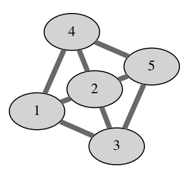

## 문제

A railroad network in a nearby country consists of n cities numbered 1 through n, and m two-way railroad tracks each connecting two different cities. Tickets can only be purchased at automated machines installed at every city. Unfortunately, hackers have tampered with the ticket machines and now they all work as follows: when a single coin is inserted in the machine installed at city a, the machine dispenses a single one-way ticket from a to a random neighboring city. More precisely, the destination city is chosen uniformly at random among all cities directly connected to a with a railroad track. Destinations on different tickets originating in the same city are independent.

A computer science student needs to travel from city 1 (where she lives) to city n (where a regional programming contest has already started). She knows how the machines work (but of course cannot predict the random choices) and has a map of the railway network. In each city, when she purchases a ticket, she can either immediately use it and travel to the destination city on the ticket, or discard the ticket and purchase a new one. She can keep purchasing tickets indefinitely. The trip is finished as soon as she reaches city n.

After doing some calculations, she has devised a traveling strategy with the following properties:

* The probability that the trip will eventually finish is 1.
* The expected number of coins spent on the trip is the smallest possible.

Find the expected number of coins she will spend on the trip.

## 입력

The first line contains two integers n and m (1 ≤ n, m ≤ 300 000) — the number of cities and the number of railroad tracks. Each of the following m lines contains two different integers a and b (1 ≤ a, b ≤ n) which describe a railroad track connecting cities a and b. There will be at most one railroad track between each pair of cities. It will be possible to reach city n starting from city 1.

## 출력

Output a single number — the expected number of coins spent. The solution will be accepted if the absolute or the relative difference from the judges solution is less than 10−6.

## 힌트

