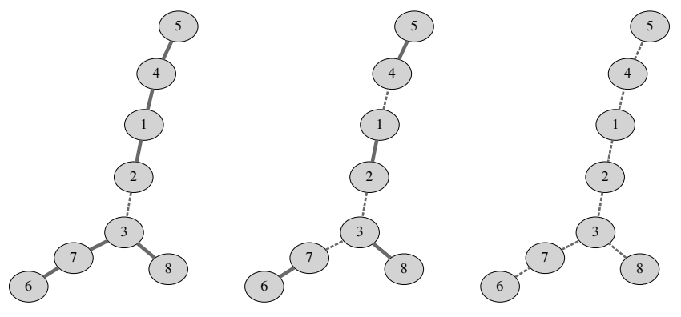

## 문제

As you probably know, a tree is a graph consisting of n nodes and n − 1 undirected edges in which any two nodes are connected by exactly one path. A forest is a graph consisting of one or more trees. In other words, a graph is a forest if every connected component is a tree. A forest is justified if all connected components have the same number of nodes.

Given a tree G consisting of n nodes, find all positive integers k such that a justified forest can be obtained by erasing exactly k edges from G. Note that erasing an edge never erases any nodes. In particular when we erase all n − 1 edges from G, we obtain a justified forest consisting of n one-node components.

## 입력

The first line contains an integer n (2 ≤ n ≤ 1 000 000) — the number of nodes in G. The k-th of the following n − 1 lines contains two different integers ak and bk (1 ≤ ak , bk ≤ n) — the endpoints of the k-th edge.

## 출력

The first line should contain all wanted integers k, in increasing order.

## 힌트

Figures depict justified forests obtained by erasing 1, 3 and 7 edges from the tree in the example input.
