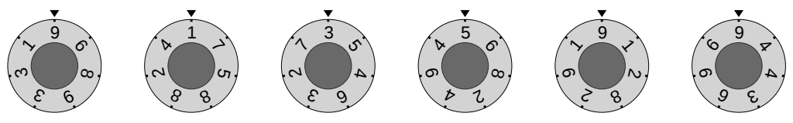

## 문제

You are cooking on a gigantic stove at a large fast-food restaurant. The stove contains n heating elements arranged in a line and numbered with integers 1 through n left to right. Each element is operated by its control knob. The knobs are a bit unusual: each knob is marked with seven non-zero digits evenly distributed around a circle. The power of the heating element is equal to the positive integer obtained by reading the digits on its control knob clockwise starting from the top of the knob.

Initial positions of the control knobs in the first example input below.

In a single step, you can rotate one or more consecutive knobs by any number of positions in any direction. However, all knobs rotated in one step need to be rotated by the same number of positions in the same direction.

Find the smallest number of steps needed to set all the heating elements to maximal possible power.

## 입력

The first line contains an integer n (1 ≤ n ≤ 501) — the number of heating elements. The j-th of the following n lines contains an integer xj — the initial power of the j-th heating element. Each xj consists of exactly seven non-zero digits.

## 출력

Output a single integer — the minimal number of steps needed.

## 힌트

In the first example, one of the ways to achieve maximal possible power is: rotate knobs 2 through 3 by 3 positions in the counterclockwise direction, rotate knob 3 by 3 positions in the counterclockwise direction, and rotate knobs 4 through 6 by 2 positions in the clockwise direction.
