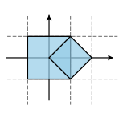
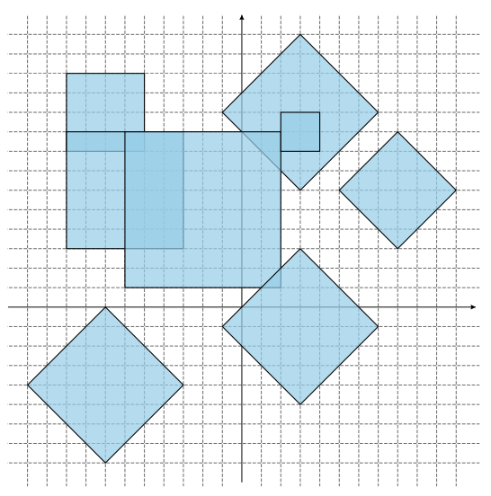

## 문제

A satellite is surveying a possible rover landing area on the moon. The landing area is modeled as a square grid embedded in the standard coordinate system.

The satellite has taken n photos, each capturing a square area of the surface. Careful camera calibration has ensured that all photos are aligned with the grid — all four vertices have integer coordinates. Due to the satellite’s changing orbit there are two types of photos:

* Photos of type Ahave sides that are parallel to coordinate axes. Such a photo is specified by giving the integer coordinates (x, y) of the square’s middle point and the length of its side a — always an even integer.
* Photos of type Bhave sides at a 45◦ angle to the coordinate axes. Such a photo is specified by giving the integer coordinates (x, y) of the square’s middle point and the length of its diagonal d — always an even integer.

Find the total surface area captured in the satellite photos.

## 입력

The first line contains an integer n (1 ≤ n ≤ 200 000) — the number of photos. The j-th of the following n lines is either of the form “A xj yj aj” or “B xj yj dj” representing a photo of type A or B, respectively. The xj and yj are the integer coordinates of the middle point of the photo (−1 000 ≤ xj, yj ≤ 1 000). The aj and dj are even integers (2 ≤ aj, dj ≤ 1 000) — the side length and the diagonal length, respectively

## 출력

Output a number with exactly two digits after the decimal point — the total area of the surface. The answer has to exactly correspond to the judge’s solution (no rounding errors are tolerated).

## 힌트

Sample 1: 

Sample 2: 
