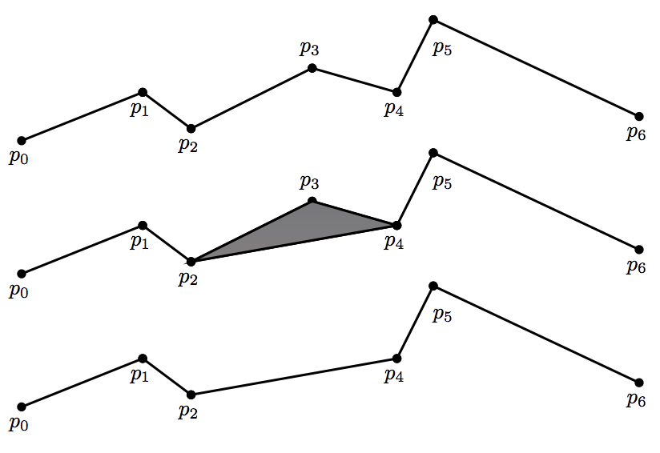

## 문제

Mapping applications often represent the boundaries of countries, cities, etc. as polylines, which are connected sequences of line segments. Since fine details have to be shown when the user zooms into the map, these polylines often contain a very large number of segments. When the user zooms out, however, these fine details are not important and it is wasteful to process and draw the polylines with so many segments. In this problem, we consider a particular polyline simplification algorithm designed to approximate the original polyline with a polyline with fewer segments.

A polyline with n segments is described by n + 1 points p0 = (x0, y0), . . . , pn = (xn, yn), with the ith line segment being pi−1−pi. The polyline can be simplified by removing an interior point pi (1 ≤ i ≤ n − 1), so that the line segments pi−1−pi and pi−pi+1 are replaced by the line segment pi−1−pi+1. To select the point to be removed, we examine the area of the triangle formed by pi−1, pi, and pi+1 (the area is 0 if the three points are colinear), and choose the point pi such that the area of the triangle is smallest. Ties are broken by choosing the point with the lowest index. This can be applied again to the resulting polyline, until the desired number m of line segments is reached.

Consider the example below.

The original polyline is shown at the top. The area of the triangle formed by p2, p3, and p4 is considered (middle), and p3 is removed if the area is the smallest among all such triangles. The resulting polyline after p3 is removed is shown at the bottom.

## 입력

The first line of input contains two integers n (2 ≤ n ≤ 200 000) and m (1 ≤ m < n). The next n + 1 lines specify p0, . . . , pn. Each point is given by its x and y coordinates which are integers between −5000 and 5000 inclusive. You may assume that the given points are strictly increasing in lexicographical order. That is, xi < xi+1, or xi = xi+1 and yi < yi+1 for all 0 ≤ i < n.

## 출력

Print on the kth line the index of the point removed in the kth step of the algorithm described above (use the index in the original polyline).
