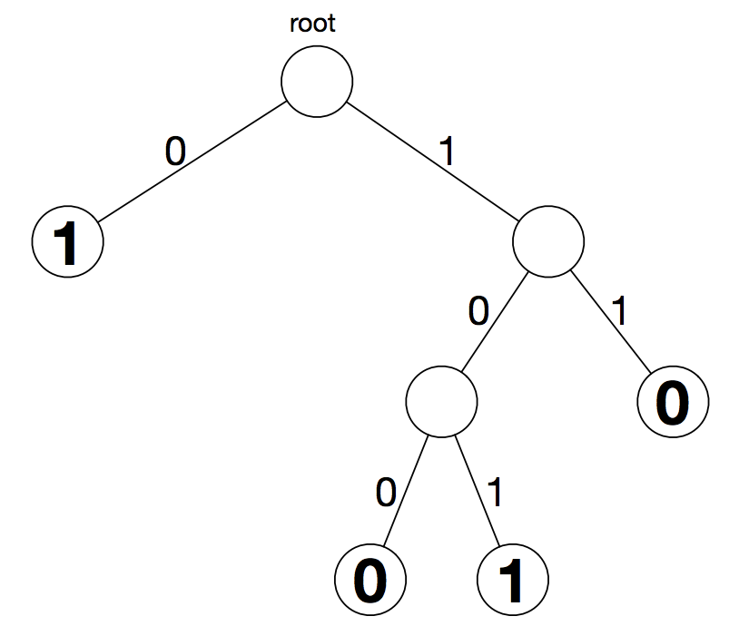

## 문제

Let x0, . . . , xn−1 denote n boolean variables (i.e., variables taking only values 0 and 1). A binary decision diagram (BDD) over these variables is a diagrammatic representation of a boolean function f(x0, . . . , xn−1) as inputs.

A BDD is a rooted binary tree such that all internal vertices v have precisely two children. The edges connecting an internal vertex v with its children are labelled with a 0 or 1 (exactly one of each). Each leaf vertex is also labelled with a 0 or 1. We note that a BDD may consist of a single vertex, which is considered to be both the root and a leaf vertex.

Given input (x0, . . . , xn−1), the boolean function represented by the BDD is evaluated as follows.

* let v be the root vertex
* let i ← 0
* while v is not a leaf do
  + replace v with the child vertex of v by traversing the edge labelled xi
  + increase i by 1
* output the label of leaf vertex v

Consider the function f(x0, x1, x2) represented by the BDD above. To evaluate f(1, 0, 1), we start from the root, we descend along edges labelled 1, 0, and then 1. We reach a leaf vertex labelled 1, so f(1, 0, 1) = 1.

A BDD is minimal if there is no way to replace any subtree of an internal vertex of the BDD by a single leaf vertex to get a new BDD defining the same boolean function. The BDD depicted above is minimal. It is a fact that for each boolean function f, there is a unique minimal BDD that represents the boolean function.

In this problem, you are given an n-variable boolean function specified by a list of the 2n different values the function should take for various inputs. Compute the number of vertices in the minimal BDD representing this function.

## 입력

The first line of input consists of a single integer 1 ≤ n ≤ 18. Then one more line follows that contains 2n values (either 0 or 1) describing an n-variable boolean function.

We think of these values as being indexed from 0 to 2n − 1. The ith such value represents f(x0, . . . , xn−1) where xj is the jth least-significant bit of the binary representation of i. In other words, xj is the coefficient of 2 j in the binary expansion of i.

The third sample input below corresponds to the BDD depicted above.

## 출력

Output consists of a single integer m that is the number of vertices in the unique minimal BDD representing the boolean function from the input.
