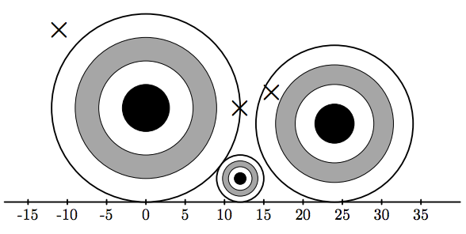

## 문제

You were invited to the annual archery tournament. You are going to compete against the best archers from all of the Northern Eurasia. This year, a new type of competition is introduced, where a shooting range is dynamic and new targets might appear at any second.

As the shooting range is far enough from you, it can be represented as a 2D plane, where y = 0 is the ground level. There are some targets in a shape of a circle, and all the targets are standing on the ground. That means, if a target’s center is (x, y) (y > 0), then its radius is equal to y, so that it touches the line y = 0. No two targets simultaneously present at the range at any given time intersect (but they may touch).

Initially, the shooting range is empty. Your participation in this competition can be described as n events: either a new target appears at the range, or you shoot an arrow at some point at the range. To hit a target, you must shoot strictly inside the circle (hitting the border does not count). If you shoot and hit some target, then the target is removed from the range and you are awarded one point.

## 입력

The first line of the input contains integer n (1 ≤ n ≤ 2·105). Next n lines describe the events happening at the tournament. The i-th line contains three integers ti, xi, and yi (ti = 1, 2; −109 ≤ xi, yi ≤ 109 ; yi > 0).

* If ti = 1, then a new target with center (xi, yi) and radius yi appears at the range.
* If ti = 2, then you perform a shot, which hits the range at (xi, yi).

## 출력

For each of your shots, output a separate line with the single integer. If the shot did not hit any target, print “-1”. If the shot hit a target, print the number of event when that target was added to the range. Events are numbered starting from 1.

## 힌트

Illustration shows the state of the range after first six events. The rightmost target was hit by the last shot and is going to be removed.
