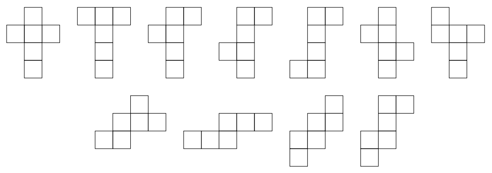

## 문제

Bella is working in a factory that produces boxes. All boxes are in a shape of rectangular parallelepipeds. A net of the corresponding parallelepiped is cut out of a flat rectangular piece of cardboard of size w ×h. This net is a polygon with sides parallel to the sides of the rectangle of the cardboard. The net is bent along several lines and is connected along the edges of the resulting parallelepiped to form a box. The net is bent only along the edges of the resulting box.

|  |  |
| --- | --- |
|  |  |
| The first example | The third example |

Bella is a software developer and her task is to check whether it is possible to make a box of size a×b×c out of a cardboard of size w × h. Bella did write a program and boxes are being produced. Can you do the same?

## 입력

The first line contains three integers a, b, and c — the dimensions of the box.

The second line contains two integers w and h — the width and the height of the cardboard.

All integers are positive and do not exceed 108.

## 출력

Print “Yes” if it is possible to cut a box a × b × c out of a cardboard of size w × h. Print “No” otherwise.

## 힌트

There are 11 different nets of a cube, ignoring rotations and mirror images.

