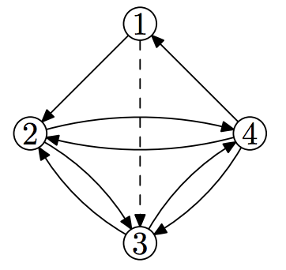

## 문제

Hard times are coming to Byteland. Quantum computing is becoming mainstream and Qubitland is going to occupy Byteland. The main problem is that Byteland does not have enough money for this war, so the King of Byteland Byteman 0x0B had decided to reform its road system to reduce expenses.

Byteland has n cities that are connected by m one-way roads and it is possible to get from any city to any other city using these roads. No two roads intersect outside of the cities and no other roads exist. By the way, roads are one-way because every road has a halfway barrier that may be passed in one direction only. These barriers are intended to force enemies to waste their time if they choose the wrong way.

The idea of the upcoming road reform is to abandon some roads so that exactly 2n roads remain. Advisers of the King think that it should be enough to keep the ability to get from any city to any other city. (Maybe even less is enough? They do not know for sure.) The problem is how to choose roads to abandon. Everyone in Byteland knows that you are the only one who can solve this problem.

## 입력

Input consists of several test cases. The first line of the input contains the number of tests cases.

The first line of each test case contains n and m — the number of cities and the number of roads correspondingly (n ≥ 4, m > 2n). Each of the next m lines contains two numbers xi and yi denoting a road from city xi to city yi (1 ≤ xi, yi ≤ n, xi ≠ yi). It is guaranteed that it is possible to get from any city to any other city using existing roads only. For each pair (x, y) of cities there is at most one road going from city x to city y and at most one road going from city y to city x. The solution is guaranteed to exist. The sum of m over all test cases in a single input does not exceed 100 000.

## 출력

For each test case output m − 2n lines. Each line describes a road that should be abandoned. Print the road in the same format as in the input: the number of the source city and the number of the destination city. The order of roads in the output does not matter, but each road from the input may appear in the output at most once and each road in the output must have been in the input. It still must be possible to get from any city to any other city using the remaining roads.

## 힌트

