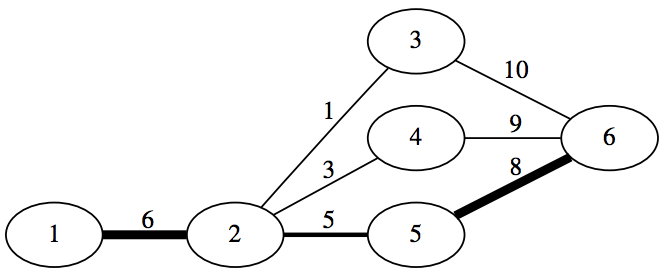
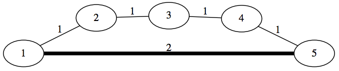

## 문제

To conduct The World Programming Cup 2112 a network of wonderful toll roads was build in European part of Russia. This network consists of m bidirectional roads that connect n cities. Each road connects exactly two distinct cities, no two roads connect the same pair of cities, and it is possible to travel from any city to any other city using only this road network. Moreover, to ease the process of charging, no two roads intersect outside of the cities.

Each road is assigned some individual positive cost. Normally, if a driver makes a trip using some of these toll roads, at the end of his journey he would be charged the total cost equal to the sum of individual costs of all roads he has used. To increase the popularity of car travels between two capitals, the operator company Radishchev Inc introduced a special offer: make a journey from Saint Petersburg to Moscow and pay for only k most expensive roads along your path.

Formally, let some path consists of l roads. Denote as c1 the cost of the most expensive road along this path, as c2 the second most expensive and so on. Thus, we have a sequence c1 ≥ c2 ≥ c3 ≥ . . . ≥ cl of individual costs of all roads along the chosen path. If l ≤ k, then the path is too short and the driver pays the sum of all individual costs as usual, i.e. Σli=1ci. If l > k, then the driver only pays for k most expensive roads, that is Σki=1ci.

As the chief analyst of Radishchev Inc you were assigned a task to compute the cheapest possible journey from Saint Petersburg to Moscow.

## 입력

The first line of the input contains three integers n, m and k (2 ≤ n ≤ 3000, 1 ≤ m ≤ 3000, 1 ≤ k < n) — the number of cities, the number of roads in the road network, and the maximum number of roads that one should pay for in a single journey.

Next m lines contain description of roads. Each road description contains three integers ui, vi, and wi (1 ≤ ui, vi ≤ n, ui ≠ vi, 1 ≤ wi ≤ 109) — the i-th bidirectional road that connects cities ui and vi with the cost of wi for any direction. It is guaranteed that there is at most one road between each pair of cities and it is possible to get from any city to any other city using only these roads.

## 출력

Print one integer equal to the minimum possible cost of travel from the city number 1 (Saint Petersburg) to the city number n (Moscow).

## 힌트

Example 1: 

Example 2: 
