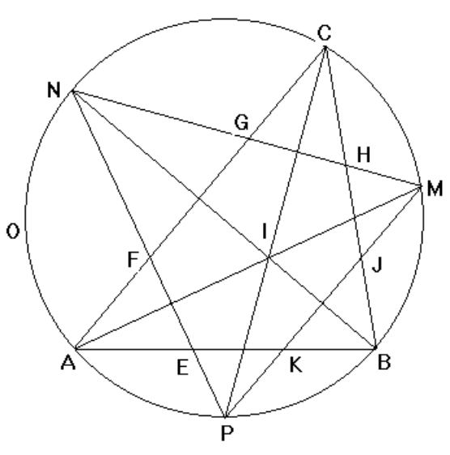

## 문제

Given a triangle ABC with incenter (center of its inscribed circle), I, and circumscribed circle O, let M, N and P be the second points of intersection of the lines through A and I, B and I resp. C and I with the circle O.

Let E and F be the intersections of the line NP with AB and AC respectively. Similarly, let G and H be the intersections of the line MN with AC and BC respectively and let J and K be the intersections of the line MP with BC and AB respectively.

Write a program which takes as input the coordinates of the vertices A, B and C of the triangle and outputs the lengths of the segments EF, FG, GH, HJ, JK and KE. Supposedly,

|EF| + |GH| + |JK| <= |KE| + |FG| + |HJ|.

Computations should be done in double precision floating point.

## 입력

The first line of input contains a single integer P, (1 ≤ P ≤ 10000), which is the number of data sets that follow. Each data set should be processed identically and independently.

Each data set consists of one line of input. The line contains the data set number, K, followed by three floating point values: the x coordinate of B, Bx, the x coordinate of C, Cx and the y coordinate of C, Cy. A will always be the origin (0,0) and B will always be on the x-axis so By = 0.

## 출력

For each data set there is a single line of output. The single output line consists of the data set number, K followed by the 6 decimal values to 4 decimal places separated by spaces. The values are the lengths of EF, FG, GH, HJ, JK and KE in that order.
