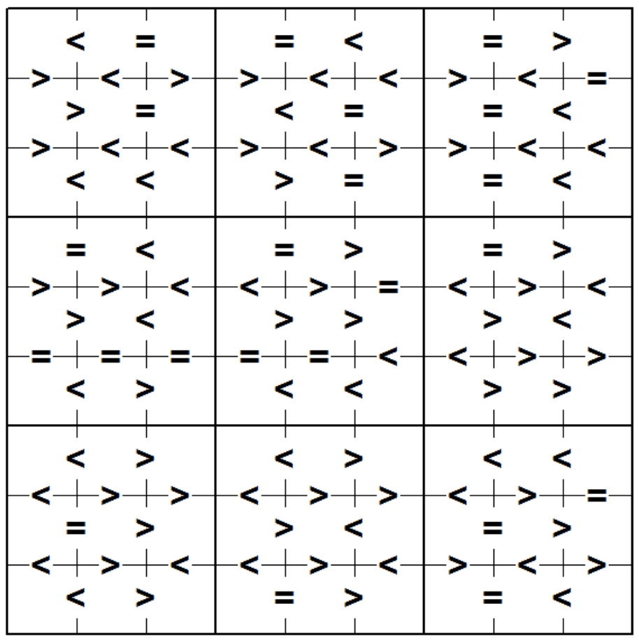

## 문제

Sumdoku is a variant of the game Sudoku. As in Sudoku, the aim is to fill in a 9-by-9 grid with the digits 1 through 9 so that each digit 1 through 9 occurs exactly once in each row, exactly once in each column and exactly once in each of the 9 3-by-3 sub-squares subject to constraints on the choices. In Sudoku, the constraints are that certain squares must contain fixed values. In Sumdoku, the constraints are on the sum of adjacent squares within each 3-by-3 sub-square. In the illustration below, the symbols <. = and > indicate that the sum of the values on either side (or above and below) the symbol must have sum less than 10, equal to 10 or greater than 10, respectively.

Write a program to solve Sumdoku problems.

## 입력

The first line of input contains a single decimal integer P, (1 ≤ P ≤ 10000), which is the number of data sets that follow. Each data set should be processed identically and independently.

Each data set consists of a 16 lines of input. The first line contains the data set number, K. The following 15 lines consist of the characters <, = or >. Rows 1, 3, 5, 6, 8, 10, 11, 13 and 15 contain 6 characters corresponding to constraints on the sum of values to the left and right of the symbol. Rows 2, 4, 7, 9, 12 and 14 contain 9 characters corresponding to constraints on the sum of values above and below the symbol. Note: Solutions of some problems may not be unique. The judging program will just check whether your solution satisfies the constraints of the problem (row, column, 3- by-3 box and inequality constraints.

## 출력

For each data set there are 10 lines of output. The first output line consists of the data set number, K. The following 9 lines of output consist of 9 decimal digits separated by a single space. The value in the jth position in the ith line of the 9 output lines is the solution value in column j of row i.

If there are multiple solutions, print the lexicographically smallest one if the answer is read by row-major order.
