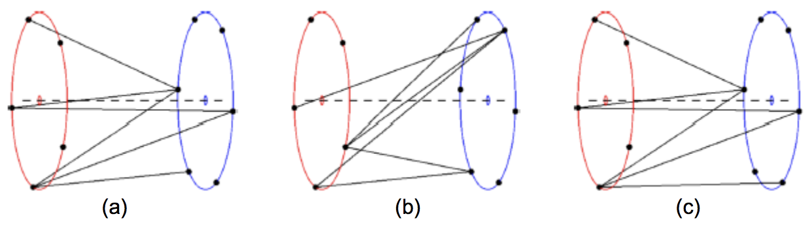

## 문제

The World Finals Contest marshals are continuously walking back and forth across the contest area and it is only a matter of time until one of them trips over a power or network cable, ruining the whole event. To keep them occupied with something less dangerous, the GNYR head judge decides to make them a little toy!

It consists of two discs (a red and a blue one), connected by an axis through their centers, around which both discs can turn independently (see the diagram below, red discs are on the left and blue discs are on the right). At the edges of the red and blue discs, there are n and m equidistant clamps, respectively. Some of the clamps on the red disc may be connected to some of the clamps on the blue disc via flexible strings. There can be multiple strings attached to each clamp but there is at most one string between any two clamps. How many different toys can the head judge produce (modulo 1,000,000,007) for fixed n and m? Two toys are considered the same if one can be obtained from the other by turning the discs by any angle (not necessarily the same!) around the toy's axis. Also, it is only relevant which two clamps a string connects, not which path it describes in the space between them.

Figure 1: (a) and (b) are the same toy (you can obtain (b) from (a) by turning the red (left) disk one and the blue (right) disk 4 steps counterclockwise). (c) is a different toy.

## 입력

The first line of input contains a single integer P, (1 ≤ P ≤ 1000), which is the number of data sets that follow. Each data set should be processed identically and independently. Each data set consists of a single line of input. It contains the data set number, K, followed by the space separated integers n and m (2 ≤ n, m ≤ 10,000,000).

## 출력

For each data set there is a single line of output. The single output line consists of the data set number, K, followed by a single space followed by the total number toys modulo 1,000,000,007 possible for the input n, m.
