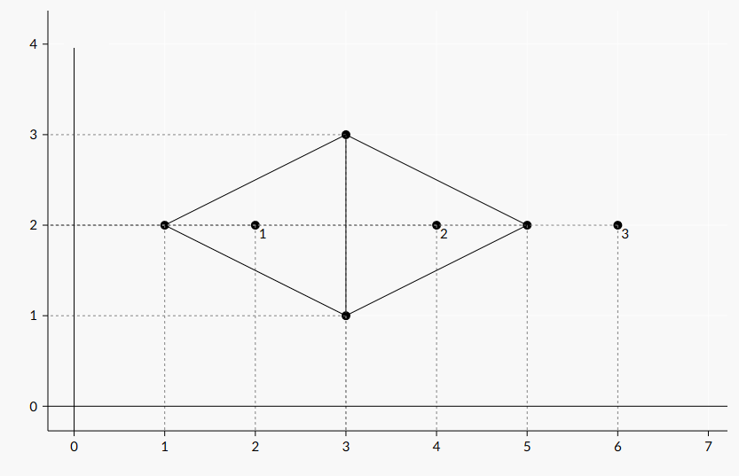

## 문제

경기과학고가 세워진 터에는 어떤 역사가 숨어 있을까? 시간을 거슬러 올라가 보자.

2000년 전, 경기과학고가 있던 자리에는 도시국가 *'인호국'*의 성이 세워져 있었다. 인호국의 성은 $1$에서 $N$까지 번호가 붙은 $N$개의 망루가 $M$개의 성벽들로 연결되어 있는 튼튼한 구조로, 성벽은 두 망루를 잇는 선분 형태로, 망루 외의 지점에서 교차하지 않으며, 모든 망루 사이를 성벽 위를 타고 이동할 수 있도록 되어 있었다. 인호국의 왕 인호는 그 성 안에 국가의 기밀 정보를 숨겨 놓았다.

인호국은 또 다른 도시국가 *'민석국'*과 경쟁 중에 있었는데, 민석국의 왕 민석이는 인호국의 기밀 정보를 캐내기 위해 비밀 요원들을 성 안으로 보내기로 한다. 비밀 요원들은 매우 빠르기 때문에 성벽이 가로막고 있지 않는 한 이동 시간을 무시할 수 있다. 또, 비밀 요원들은 인호국의 성벽을 타고 넘어다닐 수 있는데, 이때는 성벽의 높이만큼의 시간이 걸린다.

민석이는 비밀 요원들에게 총 $Q$개의 지점을 순서대로 방문해 조사하고 오라는 명령을 내렸다. 이 지점들은 성벽이나 망루와 겹치지 않음이 보장된다. 민석이는 비밀 요원들이 똑똑하다고 생각했기 때문에, 방문해야 하는 지점들만 알려 주면 알아서 빠르게 갔다 올 것이라고 믿고 있다.

하지만, 비밀 요원들은 생각만큼 똑똑하지 않았다. 그들은 어떻게 움직여야 가장 빠를지 전혀 감을 못 잡고 있다. 비밀 요원들이 빠르게 움직이지 못하면 들켜버리고 말 것이다. 비밀 요원들을 도와주자!

## 입력

첫 번째 줄에는 망루의 개수 $N$ ($1 \le N \le 200\, 000$) 과 성벽의 개수 $M$ ($N-1 \le M \le N+100$) 이 주어진다.

다음 $N$개의 줄에는 순서대로 $i$번 망루가 놓인 좌표 $x\_i$, $y\_i$가 주어진다. ($|x\_i|, |y\_i| \le 10^9$)

다음 $M$개의 줄에는 각 성벽이 잇는 두 망루의 번호 $u\_i$, $v\_i$와 망루의 높이 $h\_i$가 주어진다. ($1 \le u\_i, v\_i \le N$, $1 \le h\_i \le 10^9$)

성벽은 망루 외의 지점에서 교차하지 않음이 보장되며, 임의의 두 망루 사이를 성벽을 타고 오갈 수 있음이 보장된다.

그 다음 줄에는 민석이가 내린 명령의 개수 $Q$ ($1 \le Q \le 200\, 000$) 가 주어진다.

다음 $Q$개의 줄에는 각 지점의 좌표 $a\_i$, $b\_i$가 주어진다. ($|a\_i|, |b\_i| \le 10^9$)

모든 지점은 성벽이나 망루와 겹치지 않음이 보장된다.

## 출력

$Q$줄에 걸쳐, $i$번째 줄에는 $i-1$번째 지점에서 $i$번째 지점으로 가는 최단 시간을 출력한다.

(단, 0번째 지점의 좌표는 ($\infty$, $\infty$)로 가정한다)

## 힌트

예제를 그림으로 나타내면 다음과 같다.

