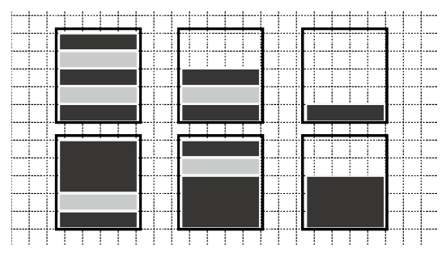

## 문제

Wendy, the master of a chocolate shop, is thinking of displaying poles of chocolate disks in the showcase. She can use three kinds of chocolate disks: white thin disks, dark thin disks, and dark thick disks. The thin disks are 1 cm thick, and the thick disks are k cm thick. Disks will be piled in glass cylinders.

Each pole should satisfy the following conditions for her secret mission, which we cannot tell.

* A pole should consist of at least one disk.
* The total thickness of disks in a pole should be less than or equal to l cm.
* The top disk and the bottom disk of a pole should be dark.
* A disk directly upon a white disk should be dark and vice versa.

As examples, six side views of poles are drawn in Figure A.1. These are the only possible side views she can make when l = 5 and k = 3.



Figure A.1. Six chocolate poles corresponding to Sample Input 1

Your task is to count the number of distinct side views she can make for given l and k to help her accomplish her secret mission.

## 입력

The input consists of a single test case in the following format.

```

l k
```

Here, the maximum possible total thickness of disks in a pole is l cm, and the thickness of the thick disks is k cm. l and k are integers satisfying 1 ≤ l ≤ 100 and 2 ≤ k ≤ 10.

## 출력

Output the number of possible distinct patterns.
