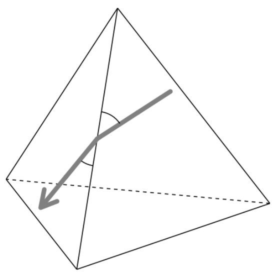
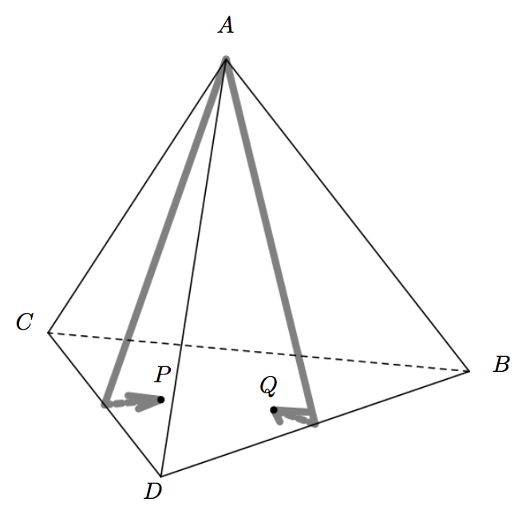

## 문제

One day, you found two worms P and Q crawling on the surface of a regular tetrahedron with four vertices A, B, C, and D. Both worms started from the vertex A, went straight ahead, and stopped crawling after a while.

When a worm reached one of the edges of the tetrahedron, it moved on to the adjacent face and kept going without changing the angle to the crossed edge (Figure G.1).

Write a program which tells whether or not P and Q were on the same face of the tetrahedron when they stopped crawling.

You may assume that each of the worms is a point without length, area, or volume.



Figure G.1. Crossing an edge

Incidentally, lengths of the two trails the worms left on the tetrahedron were exact integral multiples of the unit length. Here, the unit length is the edge length of the tetrahedron. Each trail is more than 0.001 unit distant from any vertices, except for its start point and its neighborhood. This means that worms have crossed at least one edge. Both worms stopped at positions more than 0.001 unit distant from any of the edges.

The initial crawling direction of a worm is specified by two items: the edge XY which is the first edge the worm encountered after its start, and the angle d between the edge AX and the direction of the worm, in degrees.



Figure G.2. Trails of the worms corresponding to Sample Input 1

Figure G.2 shows the case of Sample Input 1. In this case, P went over the edge CD and stopped on the face opposite to the vertex A, while Q went over the edge DB and also stopped on the same face.

## 입력

The input consists of a single test case, formatted as follows.

```

XPYP dP lP
XQYQ dQ lQ
```

XW YW (W = P, Q) is the first edge the worm W crossed after its start. XW YW is one of BC, CD or DB.

An integer dW (1 ≤ dW ≤ 59) is the angle in degrees between edge AXW and the initial direction of the worm W on the face △AXWYW.

An integer lW (1 ≤ lW ≤ 20) is the length of the trail of worm W left on the surface, in unit lengths.

## 출력

Output `YES` when and only when the two worms stopped on the same face of the tetrahedron. Otherwise, output `NO`.
