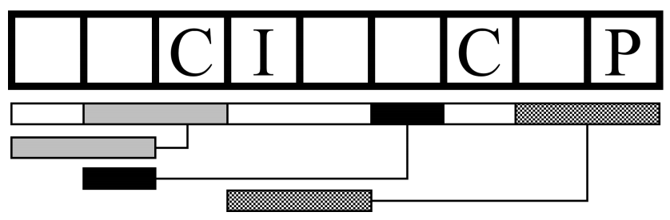

## 문제

Amazing Coding Magazine is popular among young programmers for its puzzle solving contests offering catchy digital gadgets as the prizes. The magazine for programmers naturally encourages the readers to solve the puzzles by writing programs. Let’s give it a try!

The puzzle in the latest issue is on deciding some of the letters in a string (the secret string, in what follows) based on a variety of hints. The figure below depicts an example of the given hints.



The first hint is the number of letters in the secret string. In the example of the figure above, it is nine, and the nine boxes correspond to nine letters. The letter positions (boxes) are numbered starting from 1, from the left to the right.

The hints of the next kind simply tell the letters in the secret string at some specific positions. In the example, the hints tell that the letters in the 3rd, 4th, 7th, and 9th boxes are `C`, `I`, `C`, and `P`, respectively.

The hints of the final kind are on duplicated substrings in the secret string. The bar immediately below the boxes in the figure is partitioned into some sections corresponding to substrings of the secret string. Each of the sections may be connected by a line running to the left with another bar also showing an extent of a substring. Each of the connected pairs indicates that substrings of the two extents are identical. One of this kind of hints in the example tells that the letters in boxes 8 and 9 are identical to those in boxes 4 and 5, respectively. From this, you can easily deduce that the substring is `IP`.

Note that, not necessarily all of the identical substring pairs in the secret string are given in the hints; some identical substring pairs may not be mentioned.

Note also that two extents of a pair may overlap each other. In the example, the two-letter substring in boxes 2 and 3 is told to be identical to one in boxes 1 and 2, and these two extents share the box 2.

In this example, you can decide letters at all the positions of the secret string, which are “`CCCIPCCIP`”. In general, the hints may not be enough to decide all the letters in the secret string.

The answer of the puzzle should be letters at the specified positions of the secret string. When the letter at the position specified cannot be decided with the given hints, the symbol ? should be answered.

## 입력

The input consists of a single test case in the following format.

```

n a b q
x1 c1
.
.
.
xa ca
y1 h1
.
.
.
yb hb
z1
.
.
.
zq
```

The first line contains four integers n, a, b, and q. n (1 ≤ n ≤ 109) is the length of the secret string, a (0 ≤ a ≤ 1000) is the number of the hints on letters in specified positions, b (0 ≤ b ≤ 1000) is the number of the hints on duplicated substrings, and q (1 ≤ q ≤ 1000) is the number of positions asked.

The i-th line of the following a lines contains an integer xi and an uppercase letter ci meaning that the letter at the position xi of the secret string is ci. These hints are ordered in their positions, i.e., 1 ≤ x1 < · · · < xa ≤ n.

The i-th line of the following b lines contains two integers, yi and hi. It is guaranteed that they satisfy 2 ≤ y1 < · · · < yb ≤ n and 0 ≤ hi < yi. When hi is not 0, the substring of the secret string starting from the position yi with the length yi+1−yi (or n+1−yi when i = b) is identical to the substring with the same length starting from the position hi. Lines with hi = 0 does not tell any hints except that yi in the line indicates the end of the substring specified in the line immediately above.

Each of the following q lines has an integer zi (1 ≤ zi ≤ n), specifying the position of the letter in the secret string to output.

It is ensured that there exists at least one secret string that matches all the given information. In other words, the given hints have no contradiction.

## 출력

The output should be a single line consisting only of q characters. The character at position i of the output should be the letter at position zi of the the secret string if it is uniquely determined from the hints, or ? otherwise.
