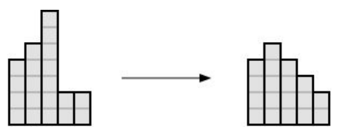

## 문제

You are given a histogram consisting of N columns of heights X1, X2, … XN, respectively. The histogram needs to be transformed into a roof using a series of operations. A roof is a histogram that has the following properties:

* A single column is called the top of the roof. Let it be the column at position i.
* The height of the column at position j (1 ≤ j ≤ N) is hj = hi - |i - j|.
* All heights hj are positive integers.

An operation can be increasing or decreasing the heights of a column of the histogram by 1. It is your task to determine the minimal number of operations needed in order to transform the given histogram into a roof.

## 입력

The first line of input contains the number N (1 ≤ N ≤ 105), the number of columns in the histogram.

The following line contains N numbers Xi (1 ≤ Xi ≤ 109), the initial column heights.

## 출력

You must output the minimal number of operations from the task.

## 힌트

Clarification of the first test case: ​By increasing the height of the second, third, and fourth column, we created a roof where the fourth column is the top of the roof.

Clarification of the second test case: ​By decreasing the height of the third column three times, and increasing the height of the fourth column, we transformed the histogram into a roof. The example is illustrated below.

