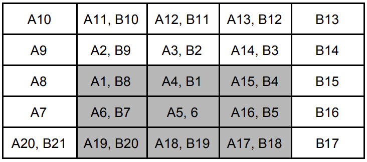

## 문제

Little Stjepan often likes to go out with his friends and have fun in a popular nightclub in Zagreb. However, Stjepan sometimes drinks too much soda and gets light headed from all the sugar. Last night was an example of this, which is why Stjepan had the same image in his mind the whole time. It was a scribble of number spirals of some sort. Since he can’t quite remember what the image looked like, but can describe it, he is asking you to reconstruct it for him.

Stjepan recalls that the image was of the shape of a table consisting of numbers written in N rows and M columns. Also, he recalls that there were K spirals in that table. For each spiral, the starting position is known, as well as the direction it’s moving in, which can be clockwise and counter-clockwise. An example is shown in the images below. The spirals created Stjepan’s image in exactly 10100 steps in the following way:

1. Initially, the table is empty, and each spiral is in its own starting position.
2. In each following step, each spiral moves to its next position. It is possible that, at times, the spirals leave the boundaries of the table, but also to return within it.
3. After exactly 10100 steps, for each field in the table, the final value is the value of the earliest step in which one of the spirals touched that field.

|  |  |
| --- | --- |
|  |  |
| Image 1: a spiral moving counter-clockwise | Image 2: a spiral moving clockwise |

## 입력

The first line of input contains positive integers N, M (1 ≤ N, M ≤ 50) and K (1 ≤ K ≤ N×M). Each of the following K lines contains three positive integers Xi, Yi and Ti (1 ≤ X ≤ N, 1 ≤ Y ≤ M, 0 ≤ T ≤ 1), the starting position of the i th spiral and its direction (0 - clockwise, 1 - counter-clockwise). No two spirals will begin in the same field.

## 출력

You must output N lines with M numbers, representing the table after each spiral makes 10100 steps.

## 힌트

Clarification of the third test case:

For simplicity’s sake, the letter A was added to the numbers from the first spiral, and the letter B to the numbers from the second spiral. Only the first 20 steps of the first spiral are shown, and 21 steps of the second spiral. The fields in gray are the fields from the table we’re interested in, all other fields are out of the table’s bounds, but are shown to illustrate the way the spirals move outside of the table.
