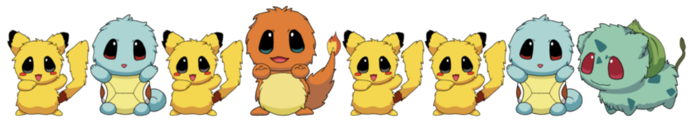
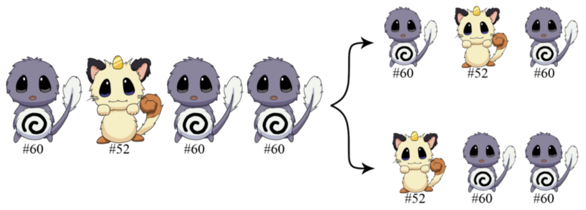

## 문제

Two of your friends, Jessie and James, are hunting Tataramon. Tataramon are little creatures that live around the village. To capture them, one must fight them and try to put them in a Tataraball.

Prepare for Tataraball! Before going around the village to look for the Tataramon, the computer in their rocket was able to predict which Tataramons they will encounter in their path. Note that each type of Tataramon has a unique number, called its ID. For example, #025 is called Pandan-kachu.

Make It Do-Double! Jessie and James just plan to take at most two of each kind of Tataramon. After all, they don’t want to be too greedy. Perhaps some boy with a red cap will want to look for Tataramon after they do. Moreover, at the end of the day, they would want the sum of all the IDs of the Tataramon they have captured to be as large as possible.

Which Tataramons should they get and in what order will they be able to obtain them? Start coding and let your programs run at the speed of light, in order to figure out the Tataramons which they should fight.

## 입력

The first line of input contains T, the number of test cases.

The first line of each test case contains a single integer, N. The second line of each test case contains N integers A1, A2, ..., AN, separated by single spaces, representing the IDs of the Tataramons in the order in which Jessie and James will encounter them.

Constraints

* 1 ≤ T ≤ 10
* 1 ≤ Ai ≤ 109
* 1 ≤ N ≤ 100000

## 출력

For each test case, output a single line consisting of space-separated integers B1, B2, ..., BM, the ID of the Tataramons which Jessie and James should capture, based on the system described in the problem statement. Moreover, they should appear in the same order as they appeared in the input.

In other words, B1, ..., BM must be a subsequence of the original sequence A1, ..., AN.

Take note that this subsequence is not necessarily unique. See sample output and explanation for more details.

## 힌트

For the first test case, according to the sample input, the first Tataramon they encounter will be Po-Libon (#60). They can either choose to capture this Po-Libon or move on, as they will still be able to capture enough Tataramons later to obtain the maximum possible sum.

The first sample output represents the case where they choose to immediately capture the first Po-Libon and the second sample output represents the case where they choose to not capture the first Po-Libon (and capture the next three Tataramon they encounter). Both of these output will be accepted since they will end up with a sum of 60+60+52 = 172.

The following image illustrates the first test case:

For the second test case, Jessie and James will encounter Buhi-lastoise (#09), Partido (#17) and Naga-saur (#01), in that order. Hence, they will capture them in that order. And this is what will let them end up with the maximum sum 9 + 17 + 1 = 27 in this test case.
