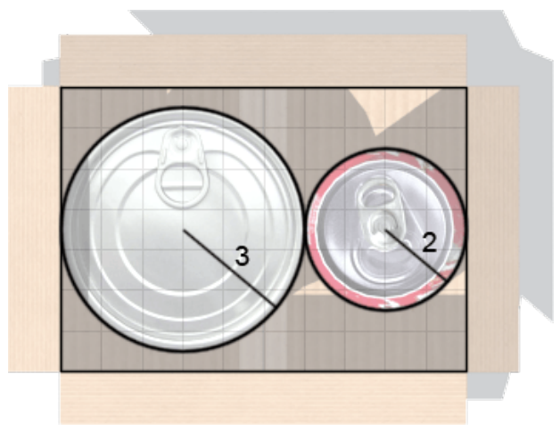

## 문제

During his childhood, Miguel always found inspiration as he watched his mother pack her sheets. As he grew older, Miguel took a job which is quite similar — packing cans.

Miguel’s job involves packing cans in a box with a rectangular base. Miguel wonders if he can pack together two cans with different radiuses in a box. We can assume that the cans are right circular cylinders of differing heights. Miguel feels he’s packing nice if both cans are standing upright (i.e. you should see the circular bases if you look at the box from the top) and he feels he’s packing well if no can is on top of the other. It is okay for Miguel to pack cans such that they touch each other on the sides. The cans can even touch the sides of the box. In fact, having them touch is usually a good idea since it means that the packing is more compact. Moreover, you may assume that the height of the box is greater than the height of any of the two cans to be packed. Miguel feels he’s packing good whenever he simultaneously feels he’s packing nice and packing well. Otherwise, he feels he’s packing bad.

Given the radiuses of their bases, can he arrange the cans in the box such that he feels he’s packing good?

## 입력

The first line of input contains T, the number of test cases.

The next T lines each contain four positive integers L, W, R1, R2, separated by single spaces. L and W are the dimensions of the base of the box, and R1 and R2 are the radiuses of the two cans to be packed.

Constraints

* 1 ≤ T ≤ 105
* 1 ≤ L ≤ 104
* 1 ≤ W ≤ 104
* 1 ≤ R1 ≤ 104
* 1 ≤ R2 ≤ 104

## 출력

For each test case, output a single line containing `PACKING GOOD` if Miguel feels he’s packing good. Otherwise, output a single line containing `PACKING BAD`.

## 힌트

For the first test case, the packing can be done as follows:

