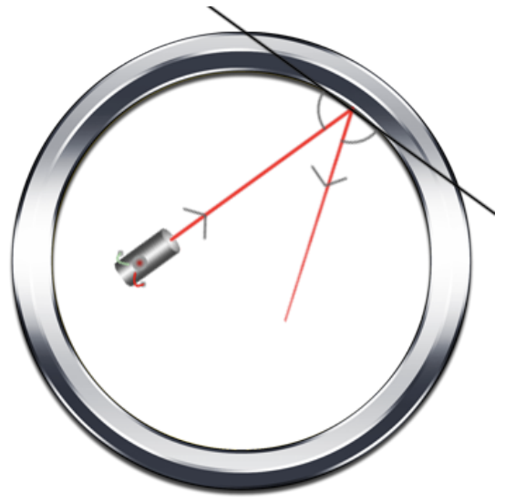
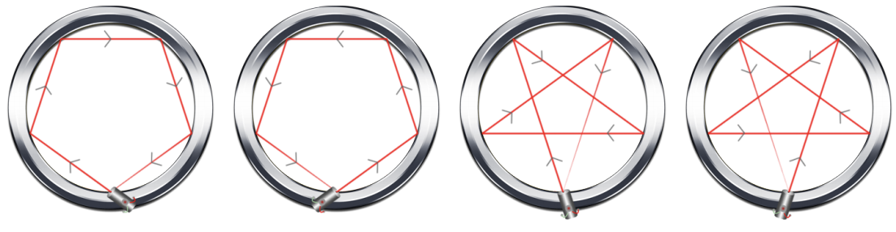
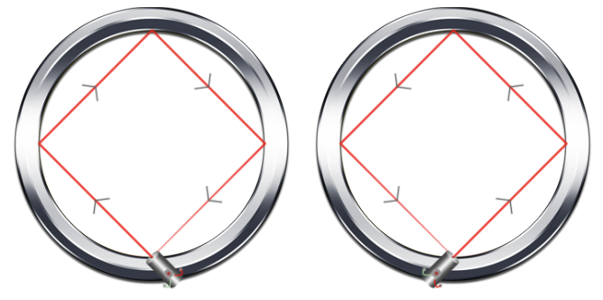

## 문제

Fidel invented a circular ring. Its boundary is made of a reflective material and at one point on the circle’s boundary, a laser is placed. He wishes to set the angle of the laser in such a way that it bounces N times around the circle then returns to its original position. How many ways can he choose the initial direction of the laser?

Assume that the angle of incidence is equal to the angle of reflection (see the image below; the location of the laser in the image is for demonstration purposes only).

## 입력

The first line of input contains T, the number of test cases.

A test case consists of a single integer, N, on a line by itself.

Constraints

* 1 ≤ T ≤ 3000
* 1 ≤ N ≤ 109

## 출력

For each test case, output one line containing the number of ways to launch the laser so that it bounces exactly N times and returns at the exact same point.

## 힌트

For the first example, there are exactly four ways to bounce exactly four times and return to the same point. See the figure below.

For the second example, there are exactly two ways to bounce exactly three times and return to the same point. See the figure below.

