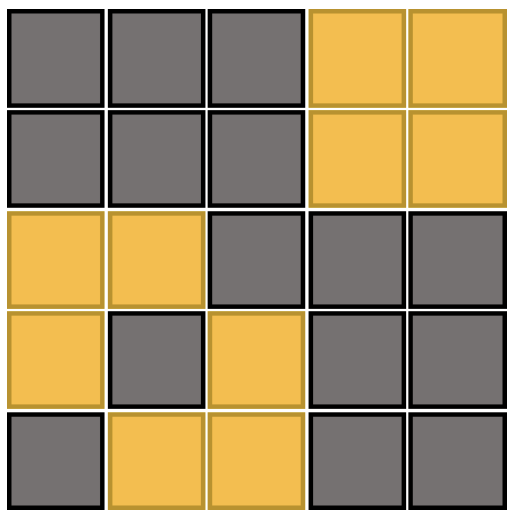
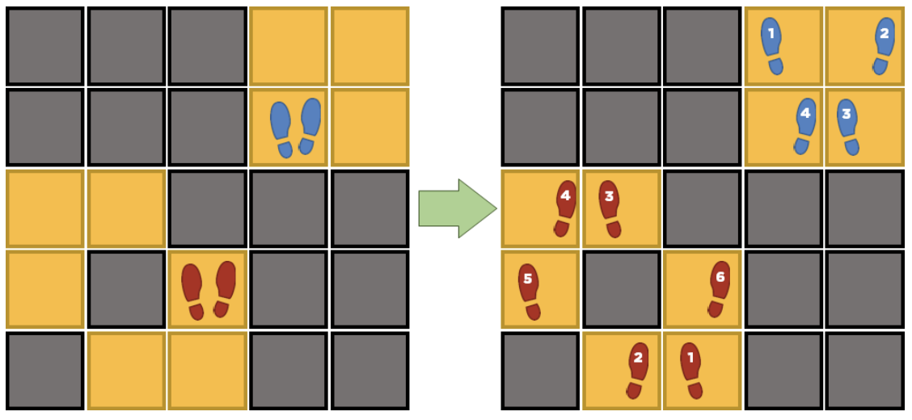

## 문제

Daryl owns a disco dance club named the Disco Dance Den. It has a disco dance floor which is in the shape of an m × n grid. At first, all of these cells are lit up. When the music starts playing, some cells of this grid become unlit.

A disco dance is a sequence of at least two steps done by a disco dancer while the music plays. The last step of a disco dance must be on the disco dancer’s starting cell.

A disco dancer only steps on lit cells while doing a disco dance. At the exact moment he steps on a lit cell, it immediately becomes unlit. Moreover, a disco dancer always satisfies the following four conditions:

1. A disco dancer alternates using his left foot and right foot at each step. He never moves both feet at the same time.
2. Whenever he moves his left foot, it always steps on a lit cell which is on the same column as his right foot.
3. Whenever he moves his right foot, it always steps on a lit cell which is on the same row of as his left foot.
4. The foot he uses for his first and last step is different.

Now, we say that Daryl’s Disco Dance Den is dark if all the cells of the disco dance floor becomes unlit.

Daryl discusses a disco dare with a group of disco dancers in his den. The disco dare goes as follows:

1. Daryl tells the disco dancers which cells will remain lit and which cells will become unlit when the music starts.
2. The disco dancers choose how many of them go on the dance floor. They can choose to let none of them go on the dance floor.
3. The disco dancers decide their starting cells and stand on them before the music starts. We clarify that standing on a cell is not the same as stepping on it.
4. The disco dancers on the dance floor must each perform a disco dance.
5. The disco dancers on the dance floor must do their disco dances one-by-one.
6. After the last disco dancer finishes his disco dance, the Disco Dance Den must be dark.

As an example, if this is the setup:

Then the disco dare can be done by having two disco dancers start at the cells indicated in the left side of the figure below:

After all the disco dancers finish their disco dance, Daryl’s Disco Dance Den is expected to go dark since all the lit cells have been stepped on. In addition, the two disco dancers on the dance floor satisfied all four conditions a disco dancer must satisfy.

Is it possible for them to do the disco dare they discussed with Daryl? If not, what is the smallest number of cells that must change their state (from lit to unlit, or vice-versa) so that it becomes possible for them to do the disco dare?

## 입력

The first line of input contains a single integer T, the number of test cases. The following lines describe the test cases.

The first line of each test case contains three space-separated integers m, n and k, in that order, specifying the number of rows and columns of the grid, respectively, and the number of groups of cells which will become unlit once the music starts.

The next k lines describe which cells of the disco dance floor become unlit when the music starts. Each of these lines contain four space-separated integers i0, j0, i1,  j1. This tells us that for all i and j that satisfy i0 ≤ i ≤ i1 and j0 ≤ j ≤ j1, the cell on the ith row and jth column becomes unlit when the music starts.

Note: The groups of unlit cells may overlap.

Constraints

* 1 ≤ T ≤ 2000
* 0 ≤ k ≤ 105
* 1 ≤ m, n ≤ 105
* 1 ≤ i0 ≤ i1 ≤ m
* 1 ≤ j0 ≤ j1 ≤ n
* The sum of the ks is ≤ 3 · 105

## 출력

For each test case, one line containing a single integer N, which is the smallest number of cells whose states must change so that the disco dancers can complete Daryl’s disco dare.

## 힌트

The first sample input shows that the groups of unlit cells may overlap. The solution is to flip just one cell, namely (4,2), so it becomes just like the grid shown in the images above.
