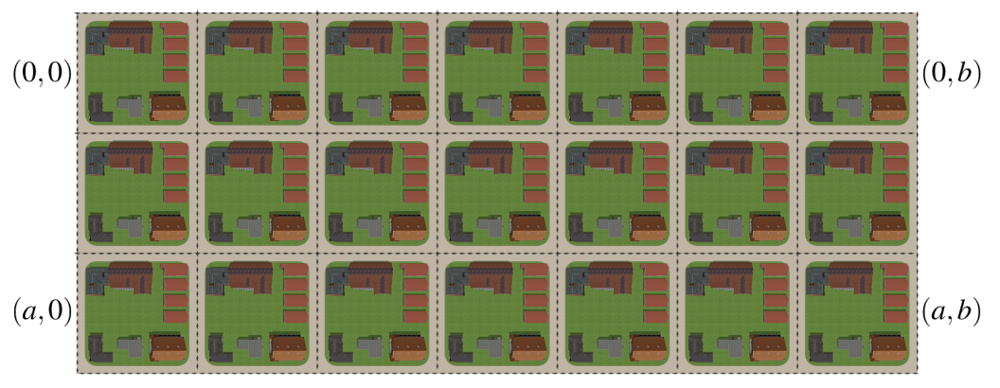

## 문제

Handbags are a very popular merchandise across the city of Manhattanila. This is because they are manufactured there.

The city of Manhattanila is composed of(a+1)(b+1) villages (locally called barangays) neatly arranged in an (a+1)×(b+1) rectangular lattice. A village is identified by two integers (x, y), 0 ≤ x ≤ a and 0 ≤ y ≤ b, denoting its row and column number (both starting from 0).

Some s of the villages manufacture these handbags (let’s call these villages sources), while the remaining ones take their supply from one of their neighboring villages. Two villages are neighbors if they share boundaries, so each village has up to four neighboring villages. (One for each cardinal direction.) Note that these neighboring villages are not necessarily sources, so they may also take their handbag supply from another neighboring village, and so on.

The price of a handbag varies across multiple villages. A source village always sells their handbags at a fixed price. However, for a non-source village, the price depends on the price of the handbag from the village they’re supplying from. Specifically, if they get their handbags from a neighboring village which sells them at p pesos, then they will sell it at p+1 pesos. Note that their neighbors’ prices are not necessarily the same, so naturally they only take their supply from the neighbor which sells them the cheapest.

Also, a source village never takes their supply of handbags from a neighboring village, even if they might sell for less. They’re loyal to their own, after all!

It can be seen that all these rules uniquely determine the price of the handbag for all villages.

A tourist visits Manhattanila, hoping to buy some souvenirs (or pasalubong). To impress her friends, she intends to buy handbags and tell her friends that she bought it from the village where it is most expensive, while secretly buying it from the village where it is cheapest!

Please help her with her plan by answering this question: what is the most expensive price for this handbag, and how many villages sell it for this price?

## 입력

The first line of input contains T, the number of test cases.

The first line of each test case contains three integers a, b and s. Here s is the number of sources. Each of the next s lines contains three integers x, y and p, denoting that (x, y) is a source village and p is the price it sells its handbags. No (x, y) pair will appear more than once in a test case.

Constraints

* 1 ≤ T ≤ 50000
* 0 ≤ a,b ≤ 106
* 0 ≤ x ≤ a
* 0 ≤ y ≤ b
* 1 ≤ s ≤ 30
* 1 ≤ p ≤ 109
* The sum of the s is ≤ 50000

## 출력

For each test case, output a single line containing two integers separated by a space:

* the most expensive price for the handbag, and
* the number of villages that sell it for this price.
