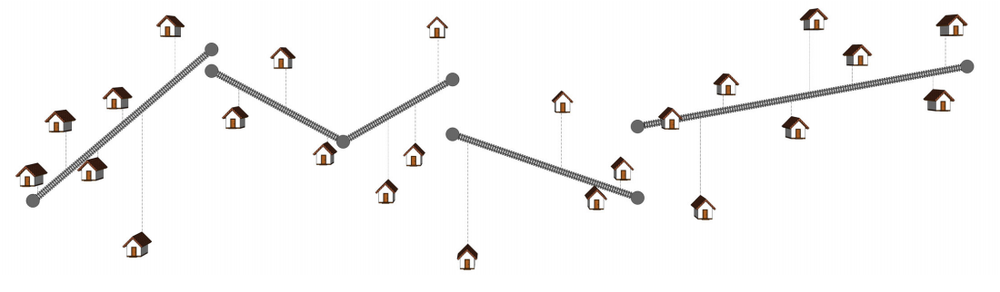

## 문제

The Country of Everlasting is planning to build a rail line that will connect its cities. During their planning stage, they have decided that the route where the rail line will pass should minimize the distance between the cities and the rail line. During the canvassing of materials, the engineers involved found out that it will be best if they buy pre-fabricated guideways from the country of Forever. However, the only available prefabricated guideways are the straight guideways. If the selected route is not a straight line (for example, the figure below), then they will need to buy several pre-fabricated guideways. They can buy guideways of different lengths.

The problem now is that there is an overhead cost C for each pre-fabricated guideway imported from Forever. So they have to design the route such that the value a + bC is minimized, where:

* a is the sum of the squares of the lengths of the vertical segments from each city to the rail line.
* b is the number of pre-fabricated lines. Also, remember the following:
* The sequence of segments need not be connected.
* No pre-fabricated line must be positioned vertically.
* No vertical line intersects two pre-fabricated lines at different points in their interior.

## 입력

The first line of input contains T, the number of test cases.

The first line of each test case contains two numbers separated by a space: the integer n and the real number C. The next n lines describe the cities.

The ith subsequent line contains two integers xi and yi denoting the coordinates of the ith city.

Constraints

* 1 ≤ T ≤ 200
* 1 ≤ n ≤ 1000
* −1000 ≤ xi, yi ≤ 1000
* 0 < C ≤ 10000.000
* C will be given with at most 3 decimal places
* x1 < x2 < x3 < ... < xn

## 출력

For each test case, output a single line containing a single real number: the optimal value of a + bC. Your solution must be accurate to within an absolute error of 10−2 from the correct answer.
