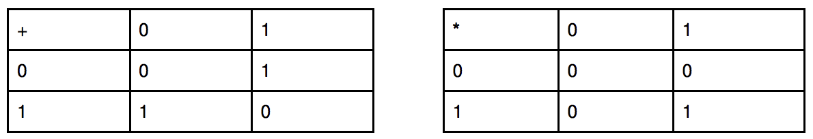

## 문제

Harry Potter has found another strange spell in Half-blood Prince diary, that could generate a different binary vector of size M. As he is not the best magician, this spell does not work perfectly so he could generate only vectors where exactly 2 elements are non zero. Harry has used this spell N times and he has constructed a matrix of M rows and N columns, where all generated vectors are columns.

Now Harry has a class of Magical Matrix Theory, where the professor asked him to calculate the rank of such a matrix. You are here to help him!

Operations in Magical Matrix Theory satisfied next rules:

The rank of a matrix A corresponds to the maximal number of linearly independent columns of A. The vectors in a set \(T = \{\vec{v\_1}, \vec{v\_2}, \dots, \vec{v\_k}\}\) are said to be linearly independent if the equation \(a\_1\vec{v\_1} + a\_2\vec{v\_2} + \dots + a\_k\vec{v\_k} = \vec{0}\), where \(a\_i = \{0, 1\}\) for \(i = 1, \dots, k\) can only be satisfied by \(a\_i = 0\) for \(i = 1, \dots, k\).

## 입력

On the first line two integers - M (size of vectors) and N (number of vectors generated by Harry). Each of the next M lines has the format: ki, c1, c2, ..., cki, where ki is the number of non-zero elements in row i. The next ki numbers are column indexes (1 ≤ cj ≤ N, j = 1, ..., ki), which are non-zero in this row. For more details, see exampels.

* 1 ≤ N ≤ 105
* 2 ≤ M ≤ 105
* 0 ≤ ki ≤ N

## 힌트

In first example, Harry has generated 3 vectors:

\(\vec{v\_1} = (1, 1, 0), \vec{v\_2} = (0, 1, 1), \vec{v\_3} = (1, 0, 1)\)

and the matrix is:

\begin{bmatrix} 1 & 0 & 1 \\ 1 & 1 & 0 \\ 0 & 1 & 1 \end{bmatrix}

But \(\vec{v\_1} + \vec{v\_2} + \vec{v\_3} = \vec{0}\).
