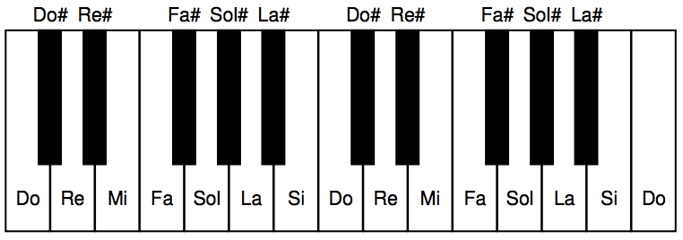

## 문제

A local radio station had a hardware malfunction and is stuck playing the same playlist in a loop. Equipped with pitch detection software, you set out to determine a lower bound to the number of songs in the playlist.

You've managed to record the whole loop, starting at an arbitrary point, and ending at the same point. The pitch detection software's output consists of the N detected musical notes in the order in which they were played.

Every musical note has one of 12 names: Do, Do#, Re, Re#, Mi, Fa, Fa#, Sol, Sol#, La, La#, or Si. The interval between any two consecutive notes from the list is called a half-step. Notes that are 12 half-steps apart share the same name; therefore, the note that follows Si is called Do, and so on.

Each of the songs is made up of two or more notes, all belonging to a single major scale.

All major scales are defined by their root note and are comprised of eight notes, of which seven have distinct names. The pitch offsets from the root note to each note in the scale are 0, 2, 4, 5, 7, 9 , 11 and 12 half-steps, respectivley (the first and last notes have the same as the root note). It is possible to build a major scale based on any root note. For example:

|  | Root +0 | Root +2 | Root +4 | Root +5 | Root +7 | Root +9 | Root +11 | Root +12 |
| --- | --- | --- | --- | --- | --- | --- | --- | --- |
| Do major | Do | Re | Mi | Fa | Sol | La | Si | Do |
| Do# major | Do# | Re# | Fa | Fa# | Sol# | La# | Do | Do# |
| Re major | Re | Mi | Fa# | Sol | La | Si | Do# | Re |
| Re# major | Re# | Fa | Sol | Sol# | La# | Do | Re | Re# |
| Mi major | Mi | Fa# | Sol# | La | Si | Do# | Re# | Mi |
| …et cetera… | | | | | | | | |

Your task is to determine M, which is the minimum number of songs that the playlist contains.

## 입력

The first line of the input file contains N <= 10 000 000 representing the number of musical notes detected. The following N lines each contain a musical note. All notes are capitalized as shown previously (i. e. the first letter is upper case; the rest are lower case).

## 출력

The output has to contain M.
