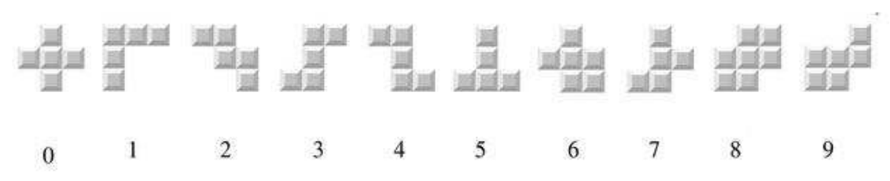

## 문제

Sonya is looking through her old toys. Among cubes and dolls she found the old video game Tetris she loved playing with. This Tetris is quite unusual, it has pieces of 10 different shapes and a grid of width 3 and height 10. You can imagine the game as an infinite stream of incoming pieces in which a sequence a is repeated continuously.

The girl decides to play Tetris. Before a piece falls down, Sonya can rotate it by any angle divisible by 90 degrees, but she can't flip it over. If all the cells in a row are covered, the row disappears, and all the rows on top of it fall down, emptying the row above them. The game is over when there is any block in the top 3 rows.

Sonya is smarter now, and she wants to maximize the number of incoming pieces before the game is over. The game might also never end. In this case you should tell Sonya not to start playing.

## 입력

The first line contains the integer n (1 ≤ n ≤ 50) - the length of the sequence a

The second line contains n integers ai (0 ≤ ai ≤ 9) - the elements of the sequence a

## 출력

Print one number - the maximum number of pieces that will fall down before game termination or -1, if it is possible to play and get an infinite number of pieces falling down.
