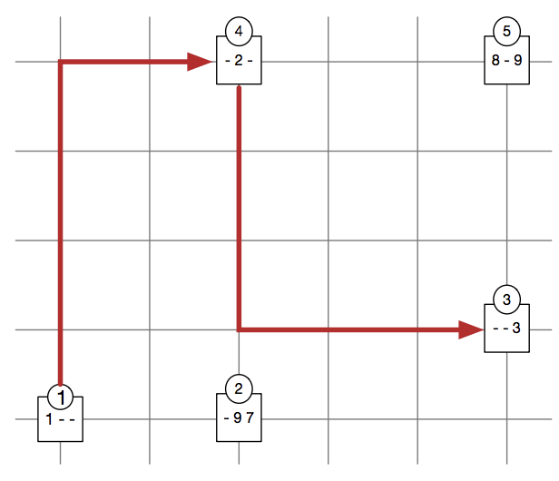

## 문제

Rachid is in Barcelona for the first time, and wants to have a really good dinner. He heard that the ultimate dinner consists of C courses, which are numbered from 1 to C and have to be consumed in that order

The streets of Barcelona form a regular grid: west–east oriented streets crossing south–north oriented streets. There are R restaurants in the city and they are located at the crossings. Walking from crossing (i1, j1) to crossing (i2, j2) takes exactly |i1 − i2| + |j1 − j2| minutes, where |x| denotes the absolute value of x. Here, (i, j) means ith street from west to east, and jth street from south to north.

Unfortunately, restaurants do not offer all of the C courses. If a restaurant k offers course c then it costs P[k, c] euros. Otherwise the value P[k, c] = 0 indicates that the course is not offered. Rachid has B euros that he can spend on his dinner. He would like to choose a sequence of restaurants so that he can have his ultimate dinner without exceeding the available budget, while minimizing the total travel time between restaurants. The tour can start and end at an arbitrary crossing, and can visit the same restaurant several times.

On this example, there are three courses, whose prices are displayed in order, for every restaurant (a “-” corresponds to a dish that is not offered, i.e., when P[k, c] = 0). If Rachid has a budget of 9 euros, the optimal tour consists of the restaurants 1–4–3 for a cost of 6 euros and a total travel time of 12 minutes. There is a shorter tour of 2 minutes consisting of the restaurant sequence 1–2–2, but its cost is 17 euros, exceeding the available budget of 9 euros.

## 입력

The input begins with a line consisting of the integers C, R, B, separated by a single space. Then R lines follow. The k-th line describes the k-th restaurant and consists of 2 + C integers separated by a single space, namely i[k], j[k], P[k, 1], . . . , P[k, C], where (i[k], j[k]) defines the location of the restaurant.

Limits

* 1 ≤ C ≤ 20;
* 1 ≤ R ≤ 100;
* 0 ≤ B ≤ 100;
* for every 1 ≤ k ≤ R:
  + 1 ≤ i[k] ≤ 1 000;
  + 1 ≤ j[k] ≤ 1 000;
  + for every 1 ≤ c ≤ C, 0 ≤ P[k, c] ≤ 40.

## 출력

The output should consist of a single integer y: the minimum total travel time of an optimal restaurant tour for Rachid. If there is no feasible tour, the value -1 should be printed.
