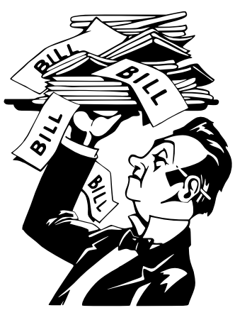

## 문제

As a tourist in Paris, you were told you should always carefully check the itemized bill (also called check) that is presented to you at the end of a meal with the list of what you ordered and the total price. Indeed, it is not uncommon for these bills to be handwritten, and for the total to be computed by hand by the waiter. You definitely do not want to overpay for your meal, and will protest if there is a mistake in the restaurant’s favor. However, if the restaurant gives you a discount, you will not complain about it.

Write a program that decides whether you should pay the total amount presented on the check, or protest about the check.

## 입력

The input is formed of 2n + 2 lines:

* lines 2k + 1 for 0 ≤ k ≤ n − 1 consist of the name of the ordered dish dk;
* lines 2k + 2 for 0 ≤ k ≤ n − 1 consist of the integer price pk of dk in euros, and the number ck of orders for dk, separated by a space;
* line 2n + 1 consists of the word “TOTAL”;
* line 2n + 2 consists of the integer total T in euros computed by the waiter.

Limits

* For every 0 ≤ k ≤ n − 1:
  + dk has at most 1 000 characters, and is never equal to “TOTAL”;
  + 0 ≤ pk ≤ 1 000;
  + 0 ≤ ck ≤ 10;
* 0 ≤ n ≤ 100 000;
* T ≤ 2 000 000 000.

## 출력

The output should consist of a single line, whose content is either “PAY” (if the displayed total is less than or equal to the actual total) or “PROTEST” (otherwise).
