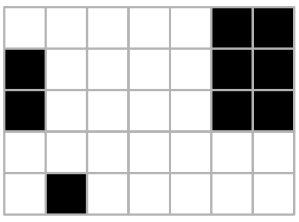

## 문제

Famous chef Clémentine Debœuf is buying new tables for her high-class restaurant. She has decided to go for the latest trend, a large model with numerous, wide, yet delicate ornaments. However, she needs to make sure that these decorations do not hamper the perfectly tuned ballet of dishes.

Ornaments reduce the amount of flat table surface where waiters can safely place dishes. Clémentine wants to make sure that all dishes can be put somewhere on the table in a sufficiently large safe area, that is, without overlapping any ornament. Given the dimensions and locations of all ornamental areas, Clémentine asks you to tell her what impact these ornaments have on the locations available for dishes.

The table is a rectangle of width X and length Y, given in millimeters. On top of it, N ornaments are placed. Each of them is located at fixed table coordinates and shaped like a rectangle whose sides are parallel to the sides of the table. Of course, none of these areas overlap each other, but they can come into contact.

In Clémentine’s restaurant, all D dishes are rectangular and placed with their sides parallel to the sides of the table, in a predetermined orientation. Waiters have millimetric precision: They will place dishes at integer millimetric coordinates with their sides parallel to those of the table. Dishes should not overlap any ornamental area (but they can touch its edges). Given a list of dishes described by their dimensions, your task is to tell, for each of them, the number of (integer) locations where it can be safely placed on the table. Note: only one dish is served at a time on the table; this means that you do not need to worry about the fact that dishes could overlap, you can count the locations for each dish independently from others.

## 입력

The input comprises several lines, each consisting of integers separated with single spaces:

* The first line consists of the integers X, Y, N, and D;
* Each of the N following lines contains the coordinates of an ornament as four integers x, x', y, and y', with 0 ≤ x < x' ≤ X and 0 ≤ y < y' ≤ Y, describing an ornament spanning between the point (x, y) and the point (x', y');
* The D following lines contain the width x and length y of dishes as two integers with 0 < x ≤ X and 0 < y ≤ Y.

Limits

* 1 ≤ X, Y ≤ 2 000;
* 0 ≤ N ≤ 1 000 000;
* 1 ≤ D ≤ 100 000.

## 출력

D lines containing the number of valid integer locations for each dish.

## 힌트

