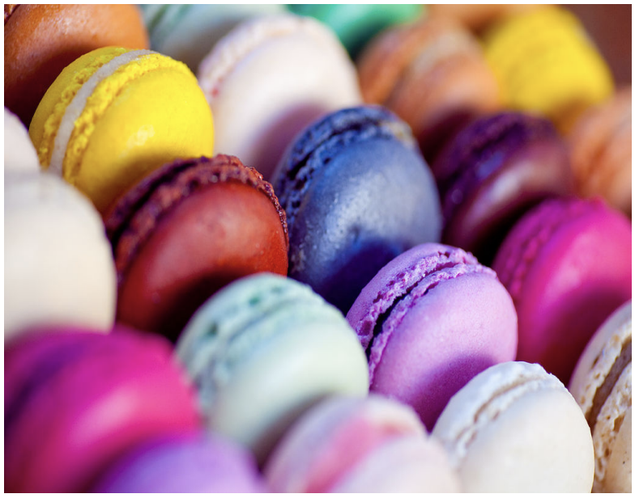

## 문제

Pierre is famous for his macarons. He makes round macarons, stored in square boxes of size 1 × 1, and oval-shaped macarons, stored in rectangular boxes of size 1 × 2 (or, rotated, in rectangular boxes of size 2 × 1). For the purpose of a buffet, Pierre wishes to tile a rectangular table of size N × M with the two kinds of macarons, meaning that the table must be completely full, with no empty space left. The width N of the table is small, for the guest to be able to grab the macarons easily, and the length M of the table is large, to accommodate a huge number of guests. To keep the table pretty, the orientation of macarons should always be aligned with the sides of the table.

Pierre wishes to know how many ways there are to tile the table. Can you help him?

## 입력

The input consists of the following integers:

* the value of N, an integer, on the first line;
* the value of M, an integer, on the second line.

Limits

The input satisfies 1 ≤ N ≤ 8 and 1 ≤ M ≤ 1018.

## 출력

The output should consist of the total number of tilings, given modulo 109, on a single line.
