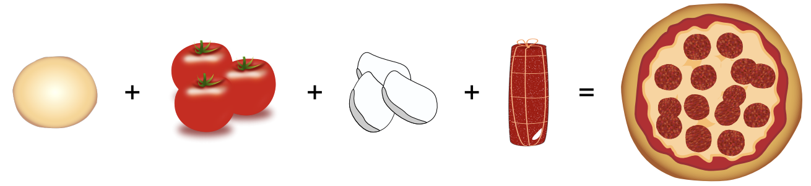

## 문제

The chef of a restaurant aspiring for a Michelin star wants to display a selection of her signature dishes for inspectors. For this, she has allocated a maximum budget B for the cumulated cost, and she wants to maximize the cumulated prestige of the dishes that she is showing to the inspectors.

To measure the prestige of her dishes, the chef maintains a list of recipes, along with their costs and ingredients. For each recipe, a derived dish is obtained from a base dish by adding an ingredient. The recipe mentions two extra pieces of information: the cost of applying the recipe, on top of the cost of the base dish, and the prestige the recipe adds to the prestige of the base dish. The chef measures the prestige by her own units, called “prestige units.”

For example, a recipe list for making pizza looks like:

* `pizza_tomato pizza_base tomato 1 2`
* `pizza_classic pizza_tomato cheese 5 5`

Here, `pizza_base` is an elementary dish, a dish with no associated recipe, a dish so simple that its cost is negligible (set to 0) and its prestige also 0. The chef can obtain the derived dish `pizza_tomato` by adding the ingredient `tomato` to the base dish `pizza_base`, for a cost of 1 euro and a gain of 2 prestige units. A `pizza_classic` is obtained from a `pizza_tomato` by adding cheese, for an added cost of 5, and a prestige of 5 added to the prestige of the base dish; this means the total cost of `pizza_classic` is 6 and its total prestige is 7.

A signature dish selection could for instance include both a `pizza_tomato` and a `pizza_classic`. Such a selection would have cumulated total prestige of 9, and cumulated total cost of 7.

Armed with the list of recipes and a budget B, the chef wants to provide a signature dish selection to Michelin inspectors so that the cumulated total prestige of the dishes is maximized, keeping their cumulated total cost at most B.

Important Notes

* No dish can appear twice in the signature dish selection.
* Any dish that does not appear as a derived dish in any recipe is considered to be an elementary dish, with cost 0 and prestige 0.
* A dish can appear more than once as a resulting dish in the recipe list; if there is more than one way to obtain a dish, the one yielding the smallest total cost is always chosen; if the total costs are equal, the one yielding the highest total prestige should be chosen.
* The recipes are such that no dish D can be obtained by adding one or more ingredients to D itself.

## 입력

* The first line consists of the budget B, an integer.
* The second line consists of the number N of recipes, an integer.
* Each of the following N lines describes a recipe, as the following elements separated by single spaces: the derived dish name (a string); the base dish name (a string); the added ingredient (a string); the added price (an integer); the added prestige (an integer).

Limits

* 0 ≤ B ≤ 10 000;
* 0 ≤ N ≤ 1 000 000;
* there can be at most 10 000 different dishes (elementary or derived);
* costs and prestiges in recipes are between 1 and 10 000 (inclusive);
* strings contain at most 20 ASCII characters (letters, digits, and ’\_’ only).

## 출력

The output should consist of two lines, each with a single integer. On the first line: the maximal cumulated prestige within the budget. On the second line: the minimal cumulated cost corresponding to the maximal cumulated prestige, necessarily less than or equal to the budget.
