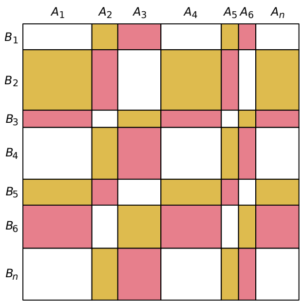

## 문제

Iskander the Baker is decorating a huge cake, covering the rectangular surface of the cake with frosting. For this purpose, he mixes frosting sugar with lemon juice and food coloring, in order to produce three kinds of frosting: yellow, pink, and white. These colors are identified by the numbers 0 for yellow, 1 for pink, and 2 for white.

To obtain a nice pattern, he partitions the cake surface into vertical stripes of width A1, A2, . . . , An centimeters, and horizontal stripes of height B1, B2, . . . , Bn centimeters, for some positive integer n. These stripes split the cake surface into n × n rectangles. The intersection of vertical stripe i and horizontal stripe j has color number (i + j) mod 3 for all 1 ≤ i, j ≤ n. To prepare the frosting, Iskander wants to know the total surface in square centimeters to be colored for each of the three colors, and asks for your help.

## 입력

The input consists of the following integers:

* on the first line: the integer n,
* on the second line: the values of A1, . . . , An, n integers separated with single spaces,
* on the third line: the values of B1, . . . , Bn, n integers separated with single spaces.

Limits

The input satisfies 3 ≤ n ≤ 100 000 and 1 ≤ A1, . . . , An, B1, . . . , Bn ≤ 10 000.

## 출력

The output should consist of three integers separated with single spaces, representing the total area for each color 0, 1, and 2.
