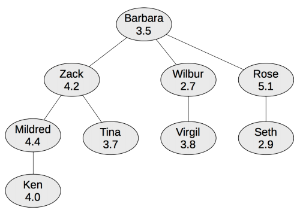

## 문제

Each year, your employer hosts a company picnic. This event features a three-legged race, a race where two runners work as a team, running side-by-side with the legs between them tied together. It is more difficult to run like that, so teams run at a speed that is the minimum of the running speed of the two team members. For example, if Mildred can run 4.4 meters per second and Ken can run 4.0 meters per second, then, as a team, they will run 4.0 meters per second.

To improve company morale, all teams are chosen so they include an employee and the supervisor they report directly to. In the organization chart below, Mildred could be on a team with Ken (running at 4.0 meters per second) or with Zack (running at 4.2 meters per second), but Mildred could not be on a team with Barbara.

Figure E.1: Organization chart illustrating the sample input below.

Given a description of the company organizational chart, your job is to create as many teams as possible for the upcoming race, provided each employee can only be on one team. To make the race exciting, you want to choose the fastest teams possible, so, while forming as many teams as you can, you must pair up team members so that the average team running speed is maximized. For example, in the chart above, you could form four teams by pairing Mildred with Ken, Zack with Tina, Wilbur with Virgil and Rose with Seth. However, a better solution would pair Rose with Barbara instead of Seth. This would still give you four teams, but it would give you a greater average speed for the teams.

## 입력

The first line of input contains an integer n (2 ≤ n ≤ 1 000) giving the total number of employees in the company. This is followed by n lines, each describing an employee. Each of these lines contains three space-separated values, first the name of the employee, then a real number giving their running speed in meters per second, and, finally, the name of their immediate supervisor in the organization chart. The organization chart is guaranteed to form a tree, with the CEO at the root. Since the CEO does not report to anyone, the input just gives “CEO” as their supervisor (no one’s name is CEO). For all other employees, the supervisor is the name of another employee listed elsewhere in the input. Employee names are all unique and consist of 1 to 12 upper- and lower-case letters (a–z), and running speeds are all in the plausible range from 2.2 meters per second up to 5.3 meters per second. Running speeds have at most 3 digits after the decimal point.

## 출력

Print the largest number of three-legged-race teams that can be formed, followed by the maximum possible average running speed for that number of teams. The speed should be accurate to within 0.001 meters per second.
