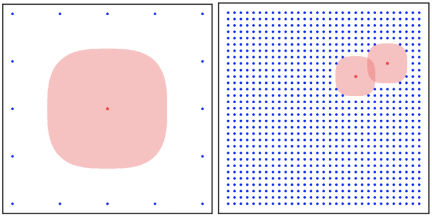

## 문제

You are planning a clever attack against a new encryption algorithm. To succeed, you need to find the key, which is a pair of integers (p, q). We can think of the key as a point on a two-dimensional integer lattice whose location is unknown. However, you know that (p, q) lies in the square spanned by the lattice points (0, 0) and (n, n) for a given n, i.e. 0 ≤ p, q ≤ n.

Your attack has three stages:

Identify safe points and their bounds.  
Eliminate as key candidates those points that lie in the “umbra” of any safe point.  
Test the remaining points to see which one is the key.

Stage 1 has already been performed and you are given several safe points of the form (x, y, b) as input.

In Stage 2 you eliminate a point (p, q) if it lies in the umbra of any safe point. Point (p, q) is in the umbra of safe point (x, y, b) if and only if

|x − p|3 + |y − q|3 ≤ b.

Your task in this problem is to count how many points will be left for testing in Stage 3 so that we have an estimate of the amount of work left to complete the attack.

Figure M.1: Sample input safe points and umbra (red) and remaining points (blue).

## 입력

Input begins with two integers n, k on a single line, separated by a space, with 2 ≤ n ≤ 100 000 000, and 0 ≤ k ≤ 100. Following that are k lines each containing three integers x, y, b separated by spaces, representing the safe points. The values of x and y are both in the range [0, n]. The bound b lies in the range [0, n].

## 출력

Output the number of points (p, q), with 0 ≤ p, q ≤ n, that do not lie in the umbra of any safe point.
