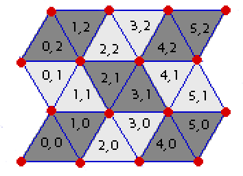

## 문제

In the game of *Rhombinoes*, you have a board made up entirely of equilateral trianges (see the image), some of which are *"live"* and some are *"dead"*. Your goal is to place down as many rhombinoes ("rhombus"-shaped pieces) as possible on the board. Each rhombino should exactly cover two "adjacent" *live* triangles that have a common side, and no two rhombinoes can use the same triangle.

Given the description of the *live* and *dead* triangles of a Rhombino board, what is the maximum number of rhombinoes you can simultaneously place down on the board?

Description of Board

Each triangle in the board has a pair of coordinates *(x, y)*. The bottom-left triangle has coordinates *(0, 0)* and will always be a triangle with its tip pointed upward. For any given triangle with coordinates *(x, y)*, the triangle adjacent to it on its right-side (if any) has coordinates *(x+1, y)*, and the triangle adjacent to it on its top-side (if any) has coordinates *(x, y+1)*. Left-side and bottom-side adjacency are defined similarly.

Each board has a width *W* and a height *H*. A board with width *W* and height *H* is the board which consists of all triangles with coordinates *(x, y)* such that *0 ≤ x < W* and *0 ≤ y < H*. For example, the game board in the image has width *6* and height *3*.

*(See the image for clarification.)*

## 입력

The first line of input contains three space-separated integers *W*, *H*, and *K*.

*W* is the width of the board, *H* is the height, and *K* is the number of dead triangles on the board (*1 ≤ W ≤ 100*, *1 ≤ H ≤ 100*, *1 ≤ K ≤ W\*H ≤ 1000*).

Exactly *K* lines will follow. Each such line will contain a pair of space-separated integers *x* and *y* (*0 ≤ x < W, 0 ≤ y < H*), indicating that the triangle with coordinates *(x,y)* is a *dead* triangle. All other triangles are *live*.

## 출력

Output a line containing a single integer, the maximum number of rhombinoes you can simultaneously place down on the board.

## 힌트

This is the board in the image, with cells *(1, 1)*, *(2, 2)*, *(4, 1)*, and *(3, 0)* dead.
