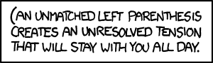

## 문제

A *balanced bracket sequence* is a string consisting only of the characters "`(`" (opening brackets) and "`)`" (closing brackets) such that each opening bracket has a "matching" closing bracket, and vice versa. For example, "`(())()`" is a balanced bracket sequence, whereas "`(())(()`" and "`())(()`" are not.

Given two bracket sequences *A* and *B* of the same length, we say that *A* is *lexicographically smaller than* *B* (and write *A < B*) if:

1. *A* and *B* differ in at least one position, and
2. *A* has a "`(`", and *B* has a "`)`" in the left-most position in which *A* and *B* differ

For example "`(())()`" < "`()()()`" because they first differ in the second position from the left, and the first string has an "`(`" in that position, whereas the second string has a "`)`". For a given length *N*, the "*<*" operator defines an *ordering* on all balanced bracket sequences of length *N*. For example, the ordering of the sequences of length *6* is:

1. `((()))`
2. `(()())`
3. `(())()`
4. `()(())`
5. `()()()`

Given a length *N* and a positive integer *M*, your task is to find the *Mth* balanced bracket sequence in the ordering.

## 입력

You will be given an *even* integer *N* (*2 ≤ N ≤ 2000*), and a positive integer *M*. It is guaranteed that *M* will be no more than *1018* and no more than the number of balanced bracket sequences of length *N* (whichever is smaller).

## 출력

Output the *Mth* balanced bracket sequence of length *N*, when ordered lexicographically.
