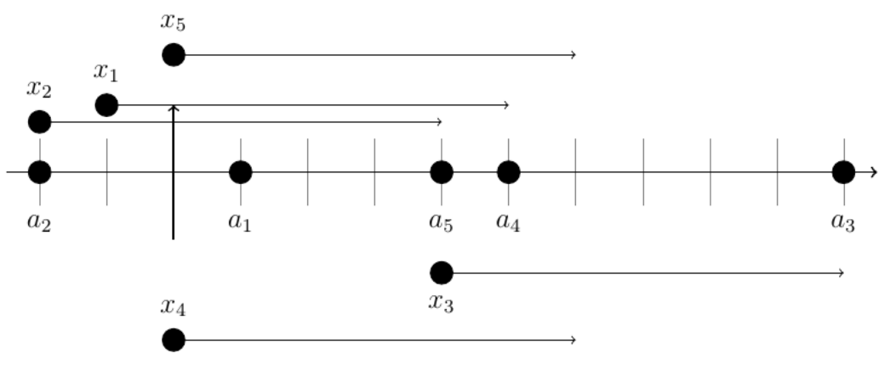

## 문제

Vera has N integers a1, . . . , aN . A margin is a non-negative integer L such that it is possible to choose N integers x1, . . . , xN such that for all i, 1 ≤ i ≤ N, the interval [xi, xi + L] contains at least K of Vera’s integers and also contains ai.

Compute the minimum possible margin.

## 입력

Line 1 contains integers N and K (1 ≤ K ≤ N ≤ 2 × 105).

Line 2 contains N integers, a1, . . . , aN (−109 ≤ ai ≤ 109).

## 출력

Print one line with one integer, the minimum possible margin.

## 힌트

For the first example, one possible solution is to choose x1 = −1, x2 = −2, x3 = 4, x4 = 0, x5 = 0, which is illustrated below.

