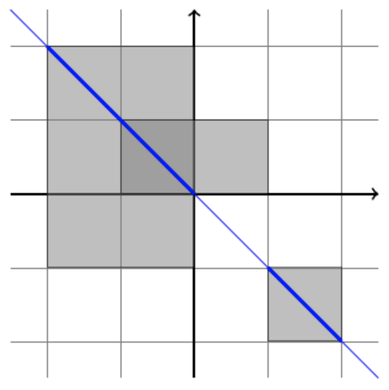

## 문제

Vera has N rectangles. The i-th rectangle has corners (ai , bi) and (ci , di). Let U be the union of the N rectangles. The intersection of U and the line y = s − x is composed of disjoint line segments (maybe degenerate ones). Let f(s) be the sum of the lengths of these line segments or be zero if the intersection is empty.

Given integers L and R, let \(S = \sum\_{s=L}^{R}{f(s)}\). It can be seen that S = V√2 for some integer V. Compute the value of V.

## 입력

Line 1 contains integers N, L, R (1 ≤ N ≤ 103, −2 × 108 ≤ L < R ≤ 2 × 108).

N lines follow. The i-th line contains integers ai, bi, ci, di (−108 ≤ ai < ci ≤ 108, −108 ≤ bi < di ≤ 108).

## 출력

Print one line with one integer, the value of V.

## 힌트

The below figure illustrates the first example when s = 0. f(0) is the sum of the lengths of the two thick blue line segments. Note that S = 7√2 ≈ 9.899.

