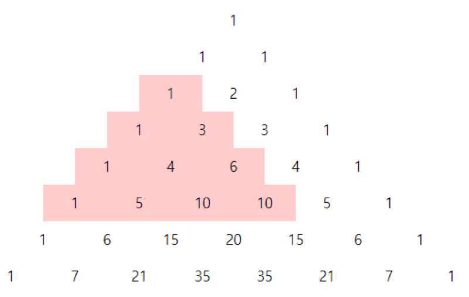

## 문제

파스칼 삼각형은 아래와 같은 모양으로 이루어져 있다. 양 끝을 제외한 각 수는 자신의 바로 왼쪽 위의 수와 바로 오른쪽 위의 수의 합으로 되어있다.

이때 R번째 줄, C번째 수를 위 꼭짓점으로 하는 한 변이 포함하는 수의 개수가 W인 정삼각형과 그 내부를 생각하자. 정삼각형의 변과 그 내부에 있는 수들의 합을 구하고 싶다. 예를 들면, 3번 째 줄, 1번 째 수를 꼭짓점으로 하고 한 변이 포함하는 수의 개수가 4인 정삼각형과 그 내부에 있는 수의 합은 1+(1+3)+(1+4+6)+(1+5+10+10) = 42 이다.

주어진 R, C, W에 대해서 그에 해당하는 합을 구하는 프로그램을 작성하여라.

## 입력

첫째 줄에 양의 정수 R, C, W가 공백을 한 칸씩 두고 차례로 주어진다. (단, 2 ≤ R+W ≤ 30, 2 ≤ C+W ≤ 30, 1 ≤ W ≤ 29, C ≤ R)

## 출력

첫째 줄에 R번째 줄, C번째 수를 위 꼭짓점으로 하는 한 변이 포함하는 수의 개수가 W인 정삼각형과 그 내부에 있는 수들의 합을 출력한다.
