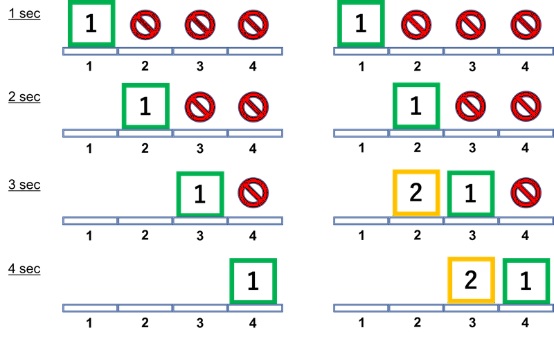

## 문제

*Awesome Conveyor Machine* (ACM) is the most important equipment of a factory of *Industrial Conveyor Product Corporation* (ICPC). ACM has a long conveyor belt to deliver their products from some points to other points. You are a programmer hired to make efficient schedule plan for product delivery.

ACM's conveyor belt goes through *N* points at equal intervals. The conveyor has plates on each of which at most one product can be put. Initially, there are no plates at any points. The conveyor belt moves by exactly one plate length per unit time; after one second, a plate is at position 1 while there are no plates at the other positions. After further 1 seconds, the plate at position 1 is moved to position 2 and a new plate comes at position 1, and so on. Note that the conveyor has the unlimited number of plates: after *N* seconds or later, each of the *N* positions has exactly one plate.

A delivery task is represented by positions *a* and *b*; delivery is accomplished by putting a product on a plate on the belt at *a*, and retrieving it at *b* after *b*−*a* seconds (*a* < *b*). (Of course, it is necessary that an empty plate exists at the position at the putting time.) In addition, putting and retrieving products must be done in the following manner:

* When putting and retrieving a product, a plate must be located just at the position. That is, products must be put and retrieved at integer seconds.
* Putting and retrieving at the same position *cannot* be done at the same time. On the other hand, putting and retrieving at the different positions can be done at the same time.

If there are several tasks, the time to finish all the tasks may be reduced by changing schedule when each product is put on the belt. Your job is to write a program minimizing the time to complete all the tasks... wait, wait. When have you started misunderstanding that you can know all the tasks initially? New delivery requests are coming moment by moment, like plates on the conveyor! So you should update your optimal schedule per every new request.

A request consists of a start point aa, a goal point bb, and the number pp of products to deliver from *a* to *b*. Delivery requests will be added *Q* times. Your (true) job is to write a program such that for each 1 ≤ *i* ≤ *Q*, minimizing the entire time to complete delivery tasks in requests 1 to *i*.

## 입력

The input consists of a single test case formatted as follows.

```

N Q
a1 b1 p1
⋮
aQ bQ pQ
```

A first line includes two integers *N* and *Q* (2 ≤ *N* ≤ 105, 1 ≤ *Q* ≤ 105): *N* is the number of positions the conveyor belt goes through and *Q* is the number of requests will come. The *i*-th line of the following *Q* lines consists of three integers *ai*, *bi*, and *pi* (1 ≤ *ai* < *bi* ≤ *N*, 1 ≤ *pi* ≤ 109), which mean that the *i*-th request requires *pi* products to be delivered from position *ai* to position *bi*.

## 출력

In the *i*-th line, print the minimum time to complete all the tasks required by requests 1 to *i*.

## 힌트

Regarding the first example, the minimum time to complete only the first request is 4 seconds. All the two requests can be completed within 4 seconds too. See the below figure.


