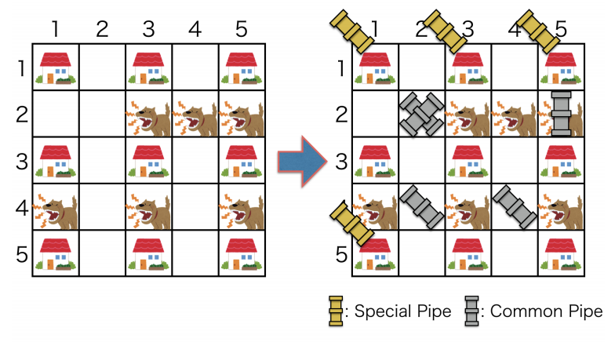

## 문제

You, a proud pipe fitter of ICPC (International Community for Pipe Connection), undertake a new task. The area in which you will take charge of piping work is a rectangular shape with W blocks from west to east and H blocks from north to south. We refer to the block at the i-th from west and the j-th from north as (i, j). The westernmost and northernmost block is (1, 1), and the easternmost and southernmost block is (W, H). To make the area good scenery, the block (i, j) has exactly one house if and only if both of i and j are odd numbers.

Your task is to construct a water pipe network in the area such that every house in the area is supplied water through the network. A water pipe network consists of pipelines. A pipeline is made by connecting one or more pipes, and a pipeline with l pipes is constructed as follows:

1. choose a first house, and connect the house to an underground water source with a special pipe.
2. choose an i-th house (2 ≤ i ≤ l), and connect the i-th house to the (i − 1)-th house with a common pipe. In this case, there is a condition to choose a next i-th house because the area is slope land. Let (x, y) be the block of the (i − 1)-th house. An i-th house must be located at either (x − 2, y + 2), (x, y + 2), or (x + 2, y + 2). A common pipe connecting two houses must be located at (x − 1, y + 1), (x, y + 1), or (x + 1, y + 1), respectively.

In addition, you should notice the followings when you construct several pipelines:

* For each house, exactly one pipeline is through the house.
* Multiple pipes can be located at one block.

In your task, common pipes are common, so you can use any number of common pipes. On the other hand, special pipes are special, so the number of available special pipes in this task is restricted under ICPC regulation.

Besides the restriction of available special pipes, there is another factor obstructing your pipe work: fierce dogs. Some of the blocks which do not contain a house seem to be home of fierce dogs. Each dog always stays at his/her home block. Since several dogs must not live at the same block as their home, you can assume each block is home of only one dog, or not home of any dogs.

The figure below is an example of a water pipe network in a 5 × 5 area with 4 special pipes. This corresponds to the first sample.



Locating a common pipe at a no-dog block costs 1 unit time, but locating a common pipe at a dog-living block costs 2 unit time because you have to fight against the fierce dog. Note that when you locate multiple pipes at the same block, each pipe-locating costs 1 unit time for no-dog blocks and 2 for dog-living blocks, respectively. By the way, special pipes are very special, so locating a special pipe costs 0 unit time.

You, a proud pipe fitter, want to accomplish this task as soon as possible. Fortunately, you get a list of blocks which are home of dogs. You have frequently participated in programming contests before being a pipe fitter. Hence, you decide to make a program determining whether or not you can construct a water pipe network such that every house is supplied water through the network with a restricted number of special pipes, and if so, computing the minimum total time cost to construct it.

## 입력

The input consists of a single test case.

```

W H K
N
x1 y1
...
xN yN
```

All numbers in a test case are integers. The first line contains three integers W, H, and K. W and H represent the size of the rectangle area. W is the number of blocks from west to east (1 ≤ W < 10,000), and H is the number of blocks from north to south (1 ≤ H < 10,000). W and H must be odd numbers. K is the number of special pipes that you can use in this task (1 ≤ K ≤ 100,000,000). The second line has an integer N (0 ≤ N ≤ 100,000), which is the number of dogs in the area. Each of the following N lines contains two integers xi and yi, which indicates home of the i-th fierce dog is the block (xi, yi). These numbers satisfy the following conditions:

* 1 ≤ xi ≤ W, 1 ≤ yi ≤ H.
* At least one of xi and yi is even number.
* i ≠ j implies (xi, yi) ≠ (xj, yj). That is, two or more dogs are not in the same block.

## 출력

If we can construct a water pipe network such that every house is supplied water through the network with a restricted number of special pipes, print the minimum total time cost to construct it. If not, print -1.
