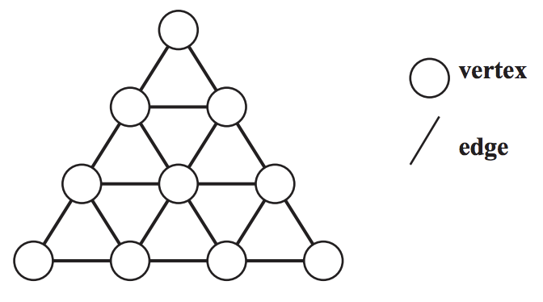
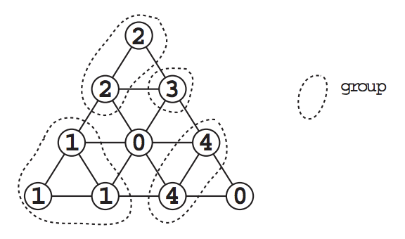

## 문제

Let's play a new board game "Life Line".

The number of the players is greater than 1 and less than 10.

In this game, the board is a regular triangle in which many small regular triangles are arranged (See Figure l). The edges of each small triangle are of the same length.



Figure 1: The board

The size of the board is expressed by the number of vertices on the bottom edge of the outer triangle. For example, the size of the board in Figure 1 is 4.

At the beginning of the game, each player is assigned his own identification number between 1 and 9, and is given some stones on which his identification number is written.

Each player puts his stone in turn on one of the "empty" vertices. An "empty vertex" is a vertex that has no stone on it.

When one player puts his stone on one of the vertices during his turn, some stones might be removed from the board. The player gains points which is equal to the number of the removed stones of others, but loses points which is equal to the number of the removed stones of himself. The points of a player for a single turn is the points he gained minus the points he lost in that turn.

The conditions for removing stones are as follows:

* The stones on the board are divided into groups. Each group contains a set of stones whose numbers are the same and placed adjacently. That is, if the same numbered stones are placed adjacently, they belong to the same group.
* If none of the stones in a group is adjacent to at least one "empty" vertex, all the stones in that group are removed from the board.



Figure 2: The groups of stones

Figure 2 shows an example of the groups of stones.

Suppose that the turn of the player '4' comes now. If he puts his stone on the vertex shown in Figure 3a, the conditions will be satisfied to remove some groups of stones (shadowed in Figure 3b). The player gains 6 points, because the 6 stones of others are removed from the board (See Figure 3c).

|  |  |  |
| --- | --- | --- |
|  |  |  |
| Figure 3a | Figure 3b | Figure 3c |

As another example, suppose that the turn of the player '2' comes in Figure 2. If the player puts his stone on the vertex shown in Figure 4a, the conditions will be satisfied to remove some groups of stones (shadowed in Figgue 4b). The player gains 4 points, because the 4 stones of others are removed. But, at the same time, he loses 3 points, because his 3 stones are removed. As the result, the player's points of this turn is 4 - 3 = 1 (See Figure 4c).

|  |  |  |
| --- | --- | --- |
|  |  |  |
| Figure 4a | Figure 4b | Figure 4c |

When each player puts all of his stones on the board, the game is over. The total score of a player is the summation of the points of all of his turns.

Your job is to write a program that tells you the maximum points a player can get (i.e., the points he gains - the points he loses) in his current turn.

## 입력

The input consists of multiple data. Each data represents the state of the board of the game still in progress.

The format of each data is as follows.

```

 N C

          S1,1
       S2,1  S2,2
    S3,1 S3,2 S3,3
          ...
  SN,1    ...    SN,N
```

*N* is the size of the board (3 ≤ *N* ≤ 10).

*C* is the identification number ofthe player whose turn comes now (1 ≤ *C* ≤ 9) . That is, your program must calculate his points in this turn.

*S**i*,*j* is the state of the vertex on the board (0 ≤ *S**i*,*j* ≤ 9) . If the value of *S**i*,*j* is positive, it means that there is the stone numbered by *S**i*,*j* there. If the value of *S**i*,*j* is 0, it means that the vertex is ``empty''.

Two zeros in a line, i.e., 0 0, represents the end of the input.

## 출력

For each data, the maximum points the player can get in the turn should be output, each in a separate line.
