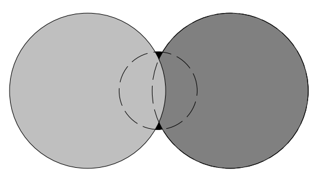

## 문제

Do you know *confetti*? They are small discs of colored paper, and people throw them around during parties or festivals. Since people throw lots of confetti, they may end up stacked one on another, so there may be hidden ones underneath.

A handful of various sized confetti have been dropped on a table. Given their positions and sizes, can you tell us how many of them you can see?

The following figure represents the disc configuration for the first sample input, where the bottom disc is still visible.



## 입력

The input is composed of a number of configurations of the following form.

```

n 		
x1 y1 z1
x2 y2 z2
.
.
.
xn yn zn
```

The first line in a configuration is the number of discs in the configuration (a positive integer not more than 100), followed by one Ine descriptions of each disc: coordinates of its center and radius, expressed as real numbers in decimal notation, with up to 12 digits after the decimal point. The imprecision margin is ±5 × 10-13. That is, it is guaranteed that variations of less than ±5 × 10-13 on input values do not change which discs are visible. Coordinates of all points contained in discs are between -10 and 10.

Confetti are listed in their stacking order, *x*1 *y*1 *r*1 being the bottom one and *xn yn rn* the top one. You are observing from the top.

The end of the input is marked by a zero on a single line.

## 출력

For each configuration you should output the number of visible confetti on a single line.
