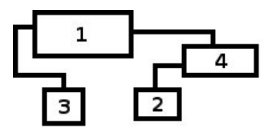

## 문제

While surfing online, Slavko came across an ad displaying a system of containers and pipes (an example of such system is illustrated in the image below) with the message: “If container **1** starts filling up with water, determine the order in which the containers get filled up.”

The system consists of K containers denoted with numbers from 1 to K, and we can describe it using a matrix of characters with N rows and M columns. The containers are **in the shape of a rectangle**​, and the outlines of the containers and pipes are shown with the following characters:

* ‘-’ if it’s a horizontal part of the outline,
* ‘|’ if it’s a vertical part of the outline, and
* ‘+’ if it’s a spot where the horizontal and vertical parts of the outline connect. An exception is where the containers and pipes connect. In that case, the container outline dominates (see sample tests).

In an arbitrary place within each container, there is a string of digits that represent the label of the container, and all the other fields in the matrix are equal to ‘.’ (dot).

All containers except the one labeled with 1 have **exactly one** supply pipe that enters the container in its **upper side**​. The container labeled with 1 does not have a supply pipe.

The containers can have multiple (also possible, zero) discharge pipes that leave the container out of its **lateral side**​. The places where discharge pipes leave a container will be in mutually **distinct rows**​ in the matrix.

The pipes directly connect two containers, which means that **it is not possible** to split the pipes or connect multiple pipes into one, and no two pipes will intersect. On their way, looking from the source to the destination container, the pipes always descend to the following row or stay in the same row. In other words, they never go back to the previous row, so the water can flow freely from one container to another.

The water enters a container until it is full. If the water level reaches the level of the discharge pipe, the water will flow through that pipe until the container the pipe leads into is filled up.

Help Slavko and determine the order in which the containers will fill up.

**Please note​:**

* The test data is such that each character ‘+’ is surrounded with **exactly one character** ‘-’ to the left or the right side and **exactly one** character ‘|’ to the upper or lower side, and **all other** adjacent characters in directions up, down, left and right will be equal to ‘.’ (dot).
* The only places where the pipe in the matrix is in a field adjacent to the container outline are the places where the pipe enters or exits the container. In other words, a pipe will never run right next to a container (except where it connects with the container). The entry for the supply pipe is labeled with the character ‘|’ above a container, whereas the exit of the discharge pipe is labeled with the character ‘-’ on the lateral side of a container.

## 입력

The first line contains two integers N and M (1 ≤ N, M ≤ 1000), matrix dimensions. The following N lines contain M characters describing the container system.

## 출력

You must output K lines. The ith line contains the label of the container that fills up ith. A solution will always exist and will be unique.

## 힌트

**Clarification of the first test case:**

Container 1 starts filling up with water.

The water level in container 1 grows, and in one moment reaches the level of the discharge pipe leading to container 2. The water flows through the pipe until container 2 fills up.

After that, the water level in container 1 keeps growing until it reaches the level of the discharge pipe leading to container 3, which fills up next.

Finally, the water level in container 1 keeps growing and the container fills up.
