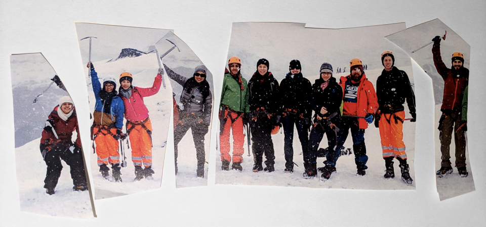

## 문제

The members of the No-Weather-too-Extreme Recreational Climbing society completed their 100th successful summit today! To commemorate the occasion, we took a picture of all the members standing together in one row, to use for marketing purposes.

However, the photograph looks messy; as usual, the members refused to order themselves in any kind of aesthetically pleasing way. We will need to reorder the picture.

Figure A.1: This picture has been cut up and pasted back together to solve Sample Input 1.

Our research tells us that having the climbers in ascending (non-decreasing) height order from left to right will be most visually appealing. We must cut up the picture we have and somehow paste it back together in this order.

Find the minimum number of cuts you need to make to put the photograph into ascending order.

## 입력

The input consists of:

* One line with an integer n (1 ≤ n ≤ 106), the number of people in the photo.
* One line with n integers h1, . . . , hn (1 ≤ hi ≤ 2 · 109 for each i), the heights of the people in the photograph, from left to right.

## 출력

Output the minimum number of cuts needed to rearrange the photograph into any one ascending (non-decreasing) height order from left to right.
