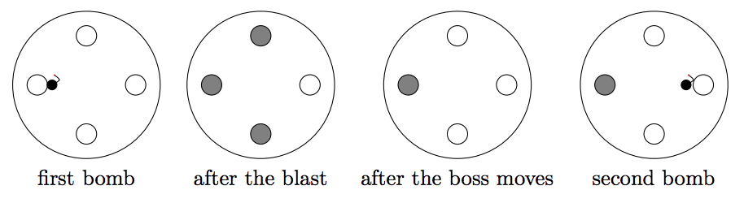

## 문제

You are stuck at a boss level of your favourite video game. The boss battle happens in a circular room with n indestructible pillars arranged evenly around the room. The boss hides behind an unknown pillar. Then the two of you proceed in turns.

* First, in your turn, you can throw a bomb past one of the pillars. The bomb will defeat the boss if it is behind that pillar, or either of the adjacent pillars.
* Next, if the boss was not defeated, it may either stay where it is, or use its turn to move to a pillar that is adjacent to its current position. With the smoke of the explosion you cannot see this movement.

The last time you tried to beat the boss you failed because you ran out of bombs. This time you want to gather enough bombs to make sure that whatever the boss does you will be able to beat it. What is the minimum number of bombs you need in order to defeat the boss in the worst case? See Figure B.1 for an example.

Figure B.1: Example for n = 4. In this case 2 bombs are enough. Grey pillars represent pillars where the boss cannot be hiding. The bomb is represented in black.

## 입력

The input consists of:

* One line with a single integer n (1 ≤ n ≤ 100), the number of pillars in the room.

## 출력

Output the minimum number of bombs needed to defeat the boss in the worst case.
