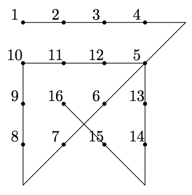

## 문제

A famous logical problem is that of connecting 9 dots on a paper by drawing 4 line segments with a pencil, while never lifting the pencil from the paper. While this is easy enough (although it requires some thinking outside of the box), Simone has recently been building a game called “Connect the Dots” around a generalisation of the concept.

In Connect the Dots, you are presented with a 4 × 4 regular grid of dots. Each dot is given a unique number between 1 and 16. The task is then to connect the dots in order by their numbers, starting with dot 1 and ending with dot 16. The dots should be connected using as few line segments as possible, starting at dot 1, with the end of each segment being the start point of the next. The segments are allowed to intersect and overlap one another. Additionally, it is allowed to pass through other points while trying to connect the current point. This means, for example, that visiting the first four points in the order 1, 4, 2, 3, 2, 4, . . . is acceptable. Formally, the sequence 1, 2, . . . , 15, 16 must be a subsequence of the sequence of dots visited.

Figure C.1: A solution to the first sample.

Simone asked you to try the puzzle out, while betting you a balloon that it would be too hard. Prove her wrong by writing a program that solves the puzzle for you!

## 입력

The input consists of:

* 4 lines, each with 4 integers, the numbers of the dots in the grid. The jth number on the ith line is the number of the jth dot in the ith row of the grid of dots.

The 16 numbers in the input are all between 1 and 16 (inclusive) and pairwise distinct.

## 출력

Output the minimum number of line segments needed to connect all the dots in order.
