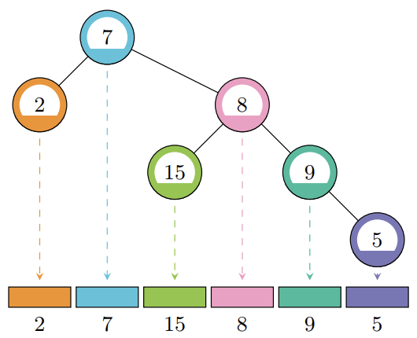

## 문제

A factor-free tree is a rooted binary tree where every node in the tree contains a positive integer value that is coprime with all of the values of its ancestors. Two positive integers are coprime if their greatest common divisor equals 1.

The inorder sequence of a rooted binary tree can be generated recursively by traversing first the left subtree, then the root, then the right subtree. See Figure F.1 below for the inorder sequence of one factor-free tree.

Figure F.1: Illustration of Sample 1. The tree is factor-free; for example, the value of the node marked “5” is coprime with all of the values of its ancestors, marked “9”, “8”, and “7”.

Given a sequence a1, a2, . . . , an, decide if it is the inorder sequence of some factor-free tree and if so construct such a tree.

## 입력

The input consists of:

* One line with one integer n (1 ≤ n ≤ 106), the length of the sequence.
* One line with n integers a1, . . . , an (1 ≤ ai ≤ 107 for each i), the elements of the sequence.

## 출력

If there exists a factor-free tree whose inorder sequence is the given sequence, output n values. For each value in the sequence, give the 1-based index of its parent, or 0 if it is the root. If there are multiple valid answers, print any one of them.

If no such tree exists, output “impossible” instead
